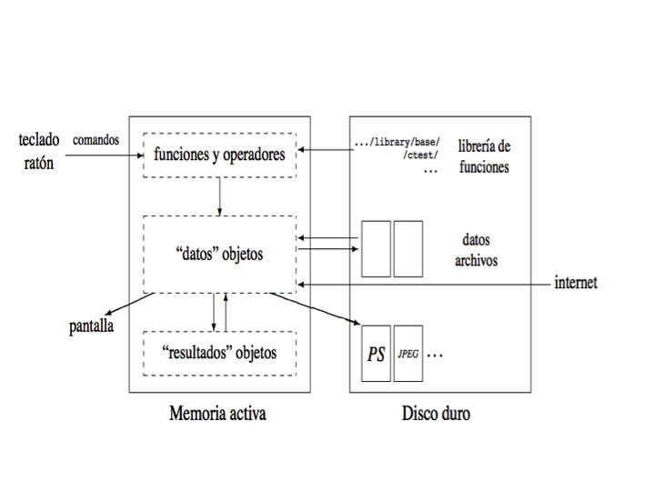
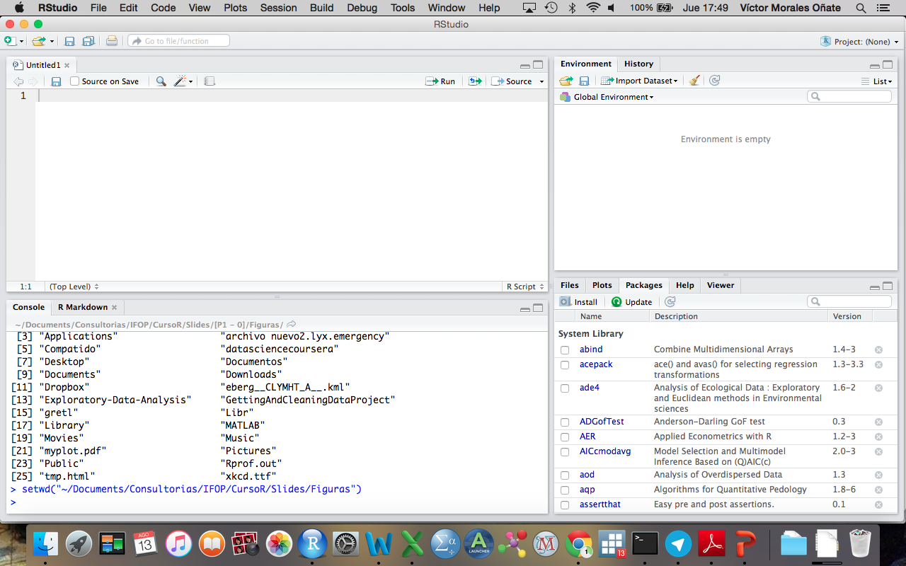

<!--
La revisión metodológica aquí vertida se basa en [@Wang_2012].
-->

```{r setup, include=FALSE}
knitr::opts_chunk$set(echo = TRUE)
knitr::opts_knit$set(root.dir = normalizePath("/Users/victormoralesonate/Documents/Consultorias&Cursos/DataLectures")) 
```

# Introducción y Preliminares

## ¿Qué es R?
- R es un ambiente y lenguaje para estadística computacional y gráficos.
- R es un dialecto del lenguaje S, es un proyecto [GNU](http://www.gnu.org/).

## ¿Qué es S?

- S es un lenguaje que fue desarrollado por John Chambers y sus colegas en laboratorios Bell.
- S se inició en 1976 como un ambiente interno de análisis estadístico - originalmente implementado como librerías [Fortran](https://es.wikipedia.org/wiki/Fortran).
- Las versiones nacientes del lenguaje no contenían funciones para modelamiento estadístico. 
- En 1988 el sistema fue re-escrito en C y empezó a parecerse al sistema que tenemos ahora (esta fue la versión 3 del lenguaje). El libro [Statistical Models in S](http://www.amazon.com/Statistical-Models-J-M-Chambers/dp/041283040X) *Chambers y Hastie* documenta la funcionalidad del análisis estadístico.
- La versión 4 del lenguaje S fue liberada en 1998 y es la versión que se usa actualmente. El libro [Programming with Data](http://www.springer.com/us/book/9780387985039) de *John Chambers* documenta esta versión del lenguaje.

##Notas Históricas

- En 1993, Laboratorios Bell le dio a *StatSci* (ahora corporación *Insightful*) una licencia exclusiva para desarrollar y vender el lenguaje S.
- En el 2004, Insightful compró a Lucent el lenguaje S por USD 2 millones y es el dueño actual.
- En el 2006, Alcatel compró Lucent y se llama Alcatel-Lucent
- Los fundamentos del lenguaje S no han cambiado desde 1998.


## De regreso a R

- 1991: Creado en Nueva Zelanda por Ross Ihaka y Robert Gentleman.
- 1993: Primer anuncio de R al público
- 1995: Martin Mächler convence a Ross y Robert que usen una licencia pública general GNU para hacer libre al software.
- 1997: Se forma el *R Core Group* (con personas asciadas con S). Este grupo controla el código fuente de R.
- 2000: La versión 1.0.0 se libera.
- 2015: Se libera la versión 3.2.2.

## Caraterísticas

- R es gratis y de código libre. 
- Disponible para Windows, Mac y Linux.
- Los gráficos de alta calidad (revelaciones de la visualización de datos y producción de gráficas para papers).
- La comunidad de R es muy dinámica (ej., crecimiento en número de paquetes), integrada por estadísticos de gran renombre.

## Sofware Libre (libertades)

0. Libertad de correr el programa para cualquier propósito.
1. Libertad de estudiar cómo funciona el programa, adaptarlo a tus necesidades. Se puede acceder al código fuente.
2. Libertad de re-distribuir copias.
3. Libertad de mejorar el programa y liberar tus mejoras al público de tal manera que se beneficie toda la comunidad. 

## Algunos recursos

Disponibles en el CRAN (https://cran.r-project.org/)

- An Introduction to R
- R Data Import/Export
- R Installation and Administration
- Writing R Extensions 
- R Internals

## En línea

- En Google +: [R en Español](https://plus.google.com/u/0/communities/113701715197444918479).
- http://stackoverflow.com
- En Facebook: [R proyect en español](https://www.facebook.com/groups/rprojectsp/)
- En YouTube: [Introducción al R - M1](https://www.youtube.com/watch?v=fOpr4-7m_ds), [Introducción al R - M2](https://www.youtube.com/watch?v=njqjlRrOHGY)

##Libros

- Matloff (2011). *The art of R programming*, William Pollock.
- Albert (2012). *R by example*, Springer.

En general, la colección de libros [USE R!](http://www.r-project.org/doc/bib/R-books.html) son excelentes.

##¿Cómo funciona?

Tomado de [R para Principiantes](https://cran.r-project.org/doc/contrib/rdebuts_es.pdf)



##Entorno

Abre el R Studio



- Script (panel superior izquerdo): es un archivo donde se almacenan las sintáxis/códigos de programación.
- Consola (panel inferior izquerdo): lugar donde se despliegan los resultados así como los comandos ejecutados (aquí se reportan los errores)
- Objetos (panel superior derecho): vectores, listas, matrices, entre otros.
- Ventana auxiliar (panel inferior derecho): ayuda, gráficos, paquetes.


## R como una calculadora

R se puede usar como una calculadora. Digite los siguientes comandos en la consola (seguido del *enter*):

```{r}
5+3

15.3 * 23.4 

sqrt(16)
```


## Almacenado y nombres

Puede guardar los valores de las variables con algún nombre para su posterior reutilización:

```{r}
producto = 15.3 * 23.4 
producto <- 15.3 * 23.4 
```

Una vez que se guardan las variables, se las puede referenciar con otros operadores y funciones:

```{r}
log(producto) 
log10(producto) 
log(producto, base=2) 
```


## Tips

- Los nombres válidos para una variable (objeto) son combinaciones de letras, números, y el punto (".").
- Los nombres no pueden empezar con un número.
- R es "case-sensitive". x != X.
- Hay nombres reservados ("function", "if", etc).
- Para comentar line-in en R se usa “#”
- Las asignaciones se hacen con "<-", y es buen estilo el rodear "<-" por un espacio a cada lado:

```{r}
x<-1:5 # Mal estilo

x <- 1:5 # Mucho mejor
```

- Para comentar bloques se usa:

```{r,eval=FALSE}
'
Este es un bloque de comentarios
'
```

- La estructura de una función en R es:

> nombredefuncion( arg1 , arg2, …)

- Las funciones se enmarcan en paréntesis y los argumentos se separan con “comas”
- En RStudio, se puede usar TAB para escribir una función más ágilmente, la completa.
- Si observa un signo “+” en la consola, quiere decir que R espera un comando, para salir use ESC


## Generación de datos

Secuencia regular de números enteros

```{r}
X <- 1:10 # Note el uso del operador “:”
```

*seq* genera secuencias de números reales:


```{r}
seq(1, 5, 0.5)
```

*scan* sirve para ingresar valores (doble enter para terminar):

```{r}
# z <- scan()
```

*rep* sirve para crear un vector con elementos idénticos:

```{r}
rep(1, 20)
```

## Funciones simples

<center>
|  Función |Descripción   |
|---|-----------------------|
|sum(x)   | suma de los elementos de x   |
| prod(x)  |   producto de los elementos de x|
| max(x)  |  valor máximo en el objeto x  |
|   min(x)|  valor mínimo en el objeto x  |
| which.max(x)   |  devuelve el índice del elemento máximo de x  |
| which.min(x)  |  devuelve el índice del elemento mínimo de x  |
|length(x)   |   número de elementos en x |
| round(x, n)   | redondea los elementos de x a n cifras decimales  |
| sort(x)  | ordena los elementos de x en orden ascendente; para hacerlo en orden descendente: rev(sort(x))|
| which(x==a)   | Devuelve un vector de los índices de x si la operaciones (TRUE (en este ejemplo, los valores de i para los cuales x[i]==a).El argumento de esta función debe ser una variable de tipo lógico |
</center>

Podemos también crear una función

```{r}
f_x <- function(x){
 y <- x^2
  y
}
```

#Importando datos en R

Es importante fijar el directorio de trabajo

```{r,eval=FALSE}
getwd() # Me dice el directorio actual
setwd("C:/data") # Fijo un nuevo directorio
```

Los archivos más usados para importación son:

- Excel   .xml (.csv)
- Stata   .dta
- SPSS    .sav

Recuerden que el comando *setwd* se lo utiliza en función del directorio en donde hayan creado la carpeta donde almacen los datos por ejemplo


```{r}
setwd("~/Documents/Consultorias&Cursos/DataLectures")
getwd()
```

### Excel

Excel: En este caso se debe abrir la hoja de datos de Excel e ir a la opción *guardar como*. En esta opción se elige *valores delimitados por comas*.

```{r}
datos.excel <- read.csv("Mundo.csv", sep=";", header=TRUE)
str(datos.excel) #Describe las variables del dataframe
help(read.csv)
head(datos.excel) #Muestra los 6 primeros valores
```


### Stata

Se requiere el paquete *foreign*

```{r,message=FALSE,warning=FALSE}
# install.packages("foreign")
library(foreign)
```


```{r,eval=FALSE,message=FALSE,warning=FALSE}
datos.stata <- read.dta("per12_2010.dta",convert.factors=TRUE)
help(read.dta)
head(datos.stata)
```


### SPSS

```{r,eval=FALSE,message=FALSE,warning=FALSE}
datos.spss <- read.spss("per12_2010.sav",use.value.labels=TRUE, max.value.labels=TRUE, to.data.frame=TRUE)
head(datos.spss) 
```
