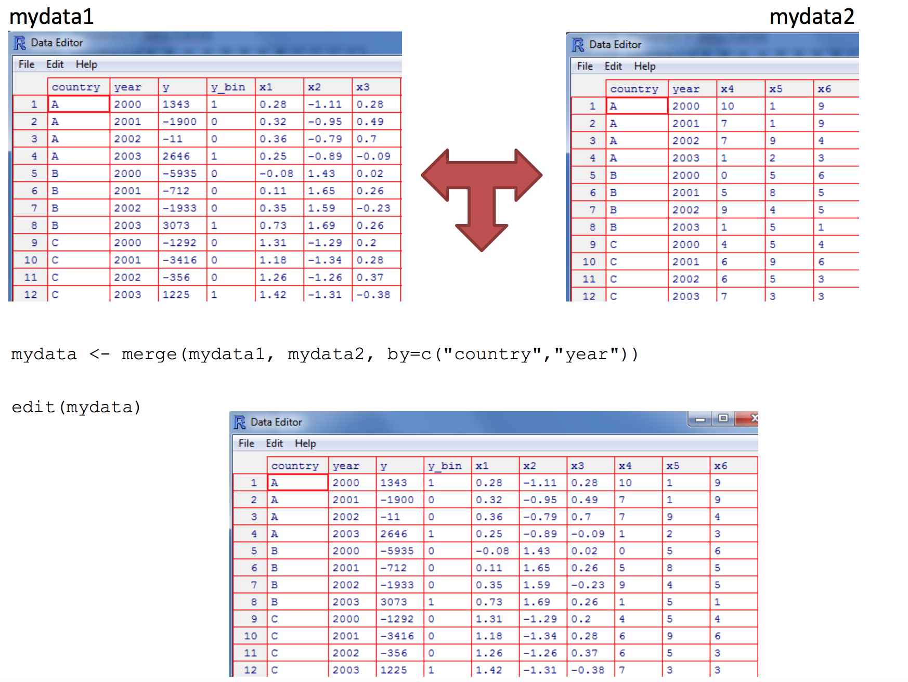
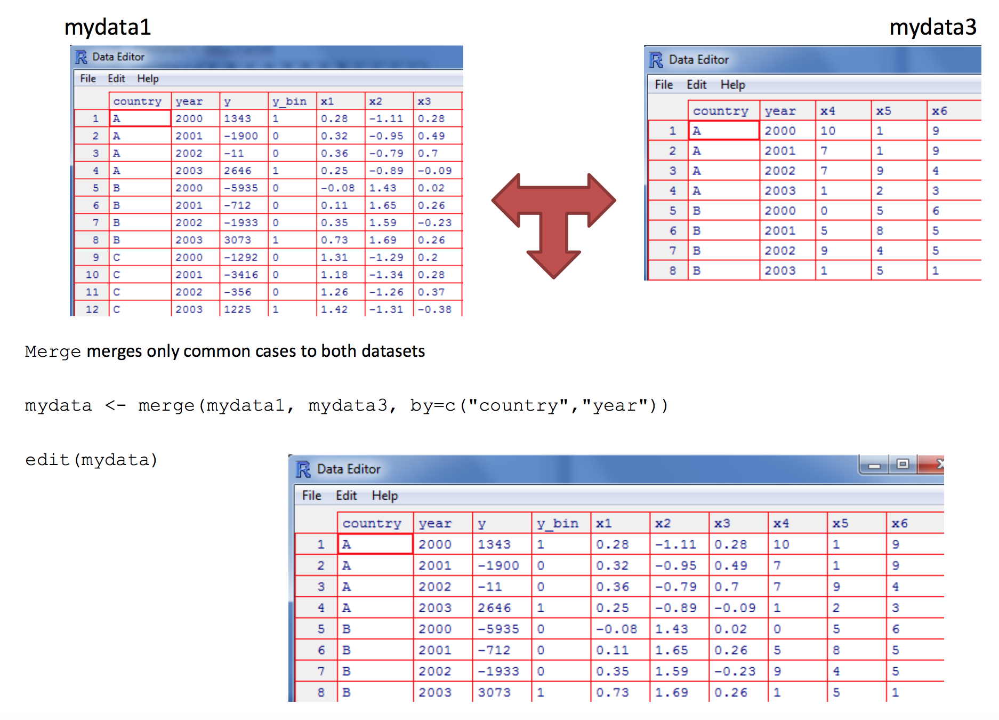
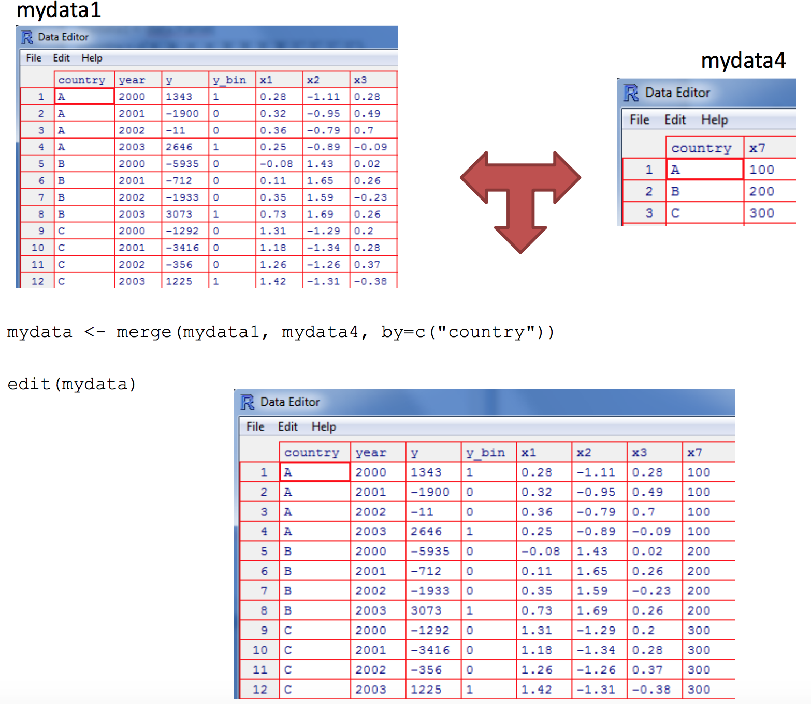
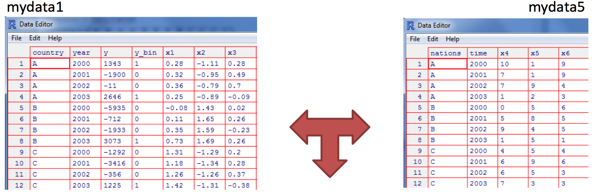
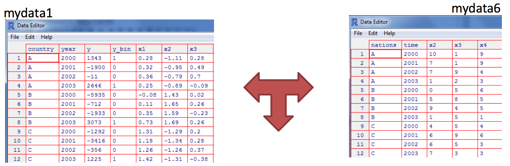
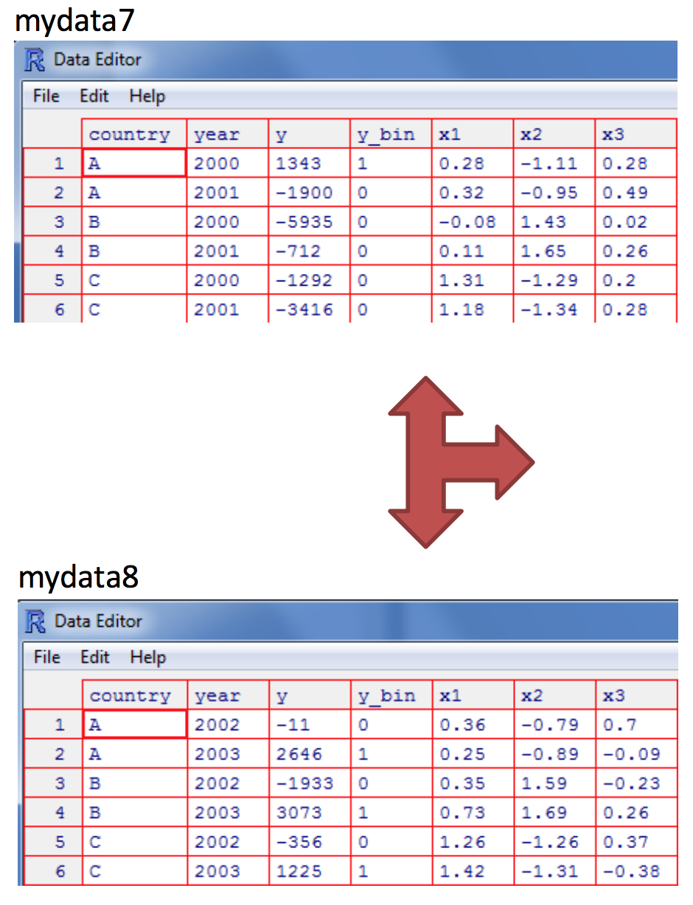

<!--
La revisión metodológica aquí vertida se basa en [@Wang_2012].
-->
```{r setup, include=FALSE}
knitr::opts_chunk$set(echo = TRUE,message = FALSE,warning = FALSE)
knitr::opts_knit$set(root.dir = normalizePath("/Users/victormoralesonate/Documents/Consultorias&Cursos/DataLectures")) 
```

# Objetos

Ya hemos visto la definición de un objeto, además de nuestro primer objeto: un vector. Ahora veremos cuatro de los objetos más usados en los primetos pasos en R: factores, listas, matrices y data.frames.

## Factor

- Un tipo de vector para datos categóricos	

```{r}
z <- factor(LETTERS[1:3], ordered = TRUE)
x <- factor(c("a", "b", "b", "a"))
x
```

Los factores son útiles cuando se conocen los valores posibles de una variable puede tomar, incluso si no se ve todos los valores en un determinado conjunto de datos. El uso de un factor en lugar de un vector de caracteres hace evidente cuando algunos grupos no contienen observaciones:

```{r}
sex_char <- c("m", "m", "m")
sex_factor <- factor(sex_char, levels = c("m", "f"))

table(sex_char)
table(sex_factor)
```


## Listas

Es *vector generalizado*. Cada lista está formada por componentes (que pueden ser otras listas), y cada componente puede ser de un tipo distinto. Son unos "contenedores generales”.

```{r}
n <- c(2, 3, 5) 
s <- c("aa", "bb", "cc", "dd", "ee") 
b <- c(TRUE, FALSE, TRUE, FALSE, FALSE) 
x <- list(n, s, b, 3)
```

A las listas a veces se les llama *vectores recursivos*, porque pueden contener otras listas.

```{r}
x <- list(list(list(list())))
str(x)
is.recursive(x)
```

`c()` combinará varias listas en una sola. Si se tiene una combinación de vectores y listas, `c()` coerciona a los vectores como listas antes de combinarlos. Compara los resultados de `list()` y `c()`:

```{r}
x <- list(list(1, 2), c(3, 4))
y <- c(list(1, 2), c(3, 4))
str(x)
str(y)
```


### Missing Values

Los valores perdidos se denotan por `NA` o `NaN` para operaciones matemáticas no definidas.

- `is.na()` se usa para comprobar si un objeto es `NA`
- `is.nan()` se usa para comprobar si un objeto es `NaN`
- `NA` también pertenecen a una clase como numeric `NA`, existe character `NA`, etc.
- Un `NaN` también es un `NA` pero al revés no es cierto

```{r}
x <- c(1, 2, NA, 10, 3)
is.na(x)
is.nan(x)
x <- c(1, 2, NaN, NA, 4)
is.na(x)
is.nan(x)
```


## Matrices y Dataframes

En esta clase, vamos a cubrir las *matrices* y *data frames*. Ambos representan los tipos de datos "rectangulares", lo que significa que se utilizan para almacenar datos tabulares, con filas y columnas.

La principal diferencia, como se verán, es que las matrices sólo pueden contener una sola clase de datos, mientras que las data frames pueden consistir en muchas clases diferentes de datos.

### Matrices


Es un tipo de objeto que contiene elementos del mismo tipo. A diferencia de los vectores, este tiene el atributo `dim`, veamos:

- Vamos a crear un vector que contiene los números del 1 al 20 con el operador `:` . Almacenar el resultado en una variable llamada my_vector.

- Escribe `dim(my_vector)`. Resulta que no tiene este atributo.

- Sin embargo, la función `dim` se usa para pedir o asignar este atributo. Escribe `dim(my_vector) <- c(4, 5)`

- Ahora, mira cuál es la dimensión de `my_vector`
    +   Al igual que en la clase de matemáticas, cuando se trata de un objeto de 2 dimensiones (piense mesa rectangular), el primer número es el número de filas y el segundo es el número de columnas. Por lo tanto, `my_vector` ahora tiene 4 filas y 5 columnas.
    +   ¡Pero espera! Eso no suena como un vector más. Bueno, no lo es. Ahora es una matriz. Ver el contenido de `my_vector` ahora para ver lo que parece. Imprime el contenido de `my_vector`

- Ves, ahora tenemos una matriz, confirmemos esto usando a función `class()`, así: `class(my_vector)`.

-   Efectivamente, `my_vector` es ahora una matriz. Deberíamos almacenarlo en una nueva variable que nos ayuda a recordar lo que es. Almacena el valor de `my_vector` en una nueva variable llamada `my_matrix`.

El código del ejemplo anterior sería:

```{r}
my_vector <- 1:20
dim(my_vector)
dim(my_vector) <- c(4, 5)
my_vector
class(my_vector)
my_matrix <- my_vector
```


El ejemplo que hemos utilizado hasta ahora estaba destinado a ilustrar el punto de que una matriz es simplemente un vector con un atributo de dimensión. Un método más directo de la creación de la misma matriz utiliza la función de `matrix()`.


- Mira la ayuda de `matrix()`. Encuentra la manera de crear una matriz que contiene los mismos números (1-20) y dimensiones (4 filas, 5 columnas) usando a la función de `matrix()`. Almacenar el resultado en una variable llamada `my_matrix2`.

- Ahora veamos si `my_matrix` y `my_matrix2` son idénticas. Usamos la función `identical()`


El código sería:

```{r}
my_matrix2 <- matrix(1:20, nrow = 4, ncol = 5)
identical(my_matrix , my_matrix2)
```

Ahora, imagina que los números en la mesa representan algunas medidas de un experimento clínico, donde cada fila representa un paciente y cada columna representa una variable para la que se tomaron mediciones.

Podemos querer etiquetar las filas, para que sepamos qué números pertenecen a cada paciente en el experimento. Una forma de hacer esto es agregar una columna a la matriz, que contiene los nombres de las cuatro personas.

- Vamos a empezar por la creación de un vector de caracteres que contiene los nombres de nuestros pacientes - Josefa, Gina, Jose, y Julio Recuerda que las comillas dobles dicen R que algo es una cadena de caracteres. Almacena el resultado en la variable llamada `patients`.

- Ahora vamos a utilizar la función `cbind()` para *combinar columnas*. No te preocupes por guardar el resultado en una nueva variable. Sólo tienes que usar `cbind()` con dos argumentos - el vector de los pacientes y `my_matrix`.

    +   Algo está raro en el resultado! Parece que la combinación del vector *character* con nuestra matriz de números hizo que todo esté entre comillas dobles. Esto significa que nos quedamos con una matriz de caracteres, lo que no es bueno.
    +   Si recuerdas, dijimos que las matrices sólo pueden contener un tipo de datos. Por lo tanto, cuando tratamos de combinar un vector de caracteres con una matriz numérica, `R` se vio obligado a *coeccionar* los números en caracteres, de ahí las comillas dobles.

### Data.frame

- Por lo tanto, estamos todavía con la cuestión de cómo incluir los nombres de nuestros pacientes en la tabla sin dañar de nuestros datos numéricos. Prueba lo siguiente - `my_data <- data.frame(patients, my_matrix)`

Parece que la función `data.frame()` nos permitió guardar nuestro vector de caracteres de los nombres justo al lado de nuestra matriz de números. Eso es exactamente lo que esperábamos!

- Chequea el tipo de objeto que hemos creado con `class(my_data)`

También es posible asignar nombres a las filas y columnas de un data frame, lo cual es otra posible forma de determinar qué fila de valores en nuestra tabla pertenece a cada paciente.

- Ya que tenemos seis columnas (incluyendo nombres de los pacientes), tendremos que crear primero un vector que contiene un elemento para cada columna. Crea un vector de caracteres llamado `cnames` que contiene los valores siguientes (en orden) - *patient*, *age*, *weight*, *bp*, *rating*, *test*.

- Ahora, utilice los `colnames()` para establecer el atributo `colnames` para nuestro data frame. Es similar a la función `dim()` que usamos antes. Imprime `my_data`.

El código sería:

```{r}
patients <- c("Josefa", "Gina", "Jose", "Julio")
cbind(patients,my_matrix)
my_data <- data.frame(patients, my_matrix)
cnames <- c("patient", "age", "weight", "bp", "rating", "test")
colnames(my_data) <- cnames
```


Desde luego, podemos crear un data frame directamente, por ejemplo

```{r}
my.data.frame <- data.frame(
	ID = c("Carla", "Pedro", 	"Laura"), 
	Edad = c(10, 25, 33), 
	Ingreso = c(NA, 34, 15),
	Sexo = c(TRUE, FALSE, TRUE),
  Etnia = c("Mestizo","Afroecuatoriana","Indígena")
)
```

### Operaciones con matrices

- R posee facilidades para manipular y hacer operaciones con matrices. Las funciones `rbind()` y `cbind()` unen matrices con respecto a sus filas o columnas respectivamente: 

```{r,results='hide'}
m1 <- matrix(1, nr = 2, nc = 2) 
m2 <- matrix(2, nr = 2, nc = 2) 

rbind(m1, m2) 
cbind(m1,m2)
```

- El operador para el producto de dos matrices es `%*%`. Por ejemplo, considerando las dos matrices m1 y m2: 

```{r,results='hide'}
ma <- rbind(m1, m2) %*% cbind(m1, m2) 
```

- La transpuesta de una matriz se realiza con la función `t`; esta función también funciona con data frames. 

```{r}
t(ma)
```


- Para el cálculo de la inversa se usa `solve`

```{r,eval=FALSE}
solve(ma)
```

Otro uso de la función `solve()` es la solución de sistemas de ecuaciones, por ejemplo:


\begin{eqnarray}
3x + 2y + z & = & 1 \\
5x + 3y + 4z & = & 2 \\
x + y -z & = & 1\\
\end{eqnarray}


Cuya solución en `R` sería:

```{r}
A <- matrix(c(3,5,1,2,3,1,1,4,-1),ncol=3)
b <- c(1,2,1)
solve(A,b)
```


## Arrays

- Generalización multidimensional de vector. Elementos del mismo tipo.

```{r}
x <- array(1:20, dim=c(4,5))
```


# Bucles

- Una ventaja de R comparado con otros programas estadísticos con “menus y botones” es la posibilidad de programar de una manera muy sencilla una serie de análisis que se puedan ejecutar de manera sucesiva. 

- Por ejemplo, definamos un vector con 50.000 componentes y calculemos el cuadrado de cada componente primero usando las propiedades de R de realizar cálculos componente a componente y luego usando un ciclo. 

```{r}
x <- 1:50000
y <- x^2
```

- Con bucles:

```{r}
z <- 0
for (i in 1:50000) z[i] <- x[i]^2 
```


## FOR

La sintaxis de la intrucción es:


>for (i in valores )
>{
>  instrucciones
>}

Ejemplo:

```{r}
for (i in 1:5)
{
  print (i)
}
```

Ejemplos

- ivalores: numérico

```{r}
for (i in c(3,2,9,6)){
	print(i^2)
}
```


- i caractér e ivalores vector:

```{r}
medios.transporte <- c("carro", "camion","metro", "moto")
	for (vehiculo in medios.transporte)
	{print (vehiculo)}
```

## While

- Ejemplo 1:

```{r}
i <- 1
while (i<=10) i <- i+4
i
```


- Ejemplo 2:

```{r}
i <- 1
while (TRUE){ # Loop similar al anterior
  i <- i+4
  if(i>10) break
}
i
```


## If - Else

- Empecemos con un ejemplo simple:

```{r}
r <- 5
if(r==4){
  x <-1
}else{
  x <- 3
  y <- 4
}
```

# Funciones

Las funciones son declaradas con `function(x,y,...)` seguido de llaves `{}`. Los valores dentro de la función son los parámetros o valores de entrada. Dentro de las llaves se ubican las operaciones a realizar con dichos parámetros.

**Combinando lo aprendido**

- Realicemos una función que cuenta el número de elementos impares en un vector:

```{r}
oddcount <- function(x)
{ 
  k <- 0 # se asigna 0 a k
  for( n in x)
    {
    if(n%%2 ==1) k <- k+1
    }
  return(k)
}
```


- Probemos la función

```{r}
x <- seq(1:3)
oddcount(x)
```


### Oasis: Algo de cálculo

- Derivada de $f(x)=e^{2x}$

```{r}
D(expression(exp(x^2)),"x") 
```


- Integral de $\int_{0}^{1}x^2$

```{r}
integrate(function(x) x^2,0,1)
```

- Chequear el paquete `ryacas` para mas cálculo simbólico


### VAN
Su expresión es $VAN = \sum_{i=0}^{n}\frac{Vi}{(1+K)^i} - I_{0}$

```{r}
VAN <- function(I0,n,K,V)
  {
  for (i in 1:n)
    {
    y[i] <- V/(1+K)^i
    }
  sum(y) - I0
  }
```


# La Familia Apply

- Existen algunas funciones que nos facilitan la vida en lugar de usar *loops*:

      + lapply: Itera sobre una lista y evalúa una función en cada elemento.
      + sapply: Lo mismo que laaply pero trata de simplifica el resultado.
      + apply: Aplica una función sobre las dimensiones de un array.
      + tapply: Aplica una función sobre subconjuntos de un vector
      + mapply: Versión multivariada de lapply


## lapply

- *lapply* siempre retorna una lista, independientemente de la clase del objeto de entrada

```{r}
x <- list(a = 1:5, b = rnorm(10))
lapply(x, mean)
```

```{r}
x <- list(a = 1:4, b = rnorm(10), 
c = rnorm(20, 1), d = rnorm(100, 5))
lapply(x, mean)
```


```{r}
x <- 1:4
lapply(x, runif)
```

## sapply

- *sapply* tratará de simplificar el resultado de lapply de ser posible

- Si el resultado es una lista donde cada elemento es de longitud 1, entonces retorna un vector
- Si el resultado es una lista donde cada elemento es un vector de la misma longitud (>1), retorna una matriz.
- Si lo puede descifrar las cosas, retorna una lista


```{r}
x <- list(a = 1:4, b = rnorm(10), c = rnorm(20, 1), d = rnorm(100, 5))
lapply(x, mean)
```


```{r}
sapply(x, mean)
mean(x)
```


## apply

- *apply* se use para evaluar una función sobre las dimensiones de un array
- Es más usado para evaluar una función sobre las filas o columnas de una matriz
- En general no es más rápido que un loop, pero cabe en una sola línea (:

```{r}
x <- matrix(rnorm(200), 20, 10)
apply(x, 2, mean)
apply(x, 1, sum)
```


- Para sumas y medias de matrices tenemos algunos \emph{shortcuts}:

      + `rowSums = apply(x, 1, sum)`
      + `rowMeans = apply(x, 1, mean)`
      + `colSums = apply(x, 2, sum)`
      + `colMeans = apply(x, 2, mean)`
      
- Las funciones cortas son más rápidas, pero no se nota  menos que se use matrices grades.

## tapply

- *tapply* Se usa para aplicar funciones sobre subconjuntos de un vector.

- Tomamos medias por grupo:

```{r}
x <- c(rnorm(10), runif(10), rnorm(10, 1))
f <- gl(3, 10)
f
tapply(x, f, mean)
```

- Para encontrar rangos por grupo:


```{r}
tapply(x, f, range)
```


### Ejercicio

Al evaluar la relación estadística de dos variables, hay muchas alternativas a la medida de correlación estándar (correlación producto-momento de Pearson). Algunos pueden haber oído hablar de la correlación de rangos de Spearman, por ejemplo. Estas medidas alternativas tienen varias motivaciones, como la solidez de valores atípicos, que son elementos de datos extremos y posiblemente erróneos.

Aquí, propongamos una nueva medida de este tipo (en realidad se relaciona con uno de amplio uso, *$\tau$ de Kendall*), pero para ilustrar algunas de las técnicas de programación R introducidas hasta el momento, especialmente `ifelse ()`.

Ayuda: Considere los vectores `x` e `y`, que son series temporales, por ejemplo, para las mediciones de las acciones de dos empresas recogidas una vez por hora. Definiremos nuestra medida de asociación entre ellos como la *fracción del tiempo `x` y `y` que aumentan o disminuyen juntos*, es decir, la proporción de `i` para la cual `y[i + 1] -y [i]` tiene el mismo signo que `x[i + 1] -x [i]`.

```{r,echo=FALSE}
# findud() convierte el vector v en 1s o 0s que representa si un elemento se incrementa o no, en relaciona a la posicion anterior; la salida tiene uno menos en su longtiud
findud <- function(v) {
vud <- v[-1] - v[-length(v)]
return(ifelse(vud > 0,1,0))
}

udcorr <- function(x,y) {
ud <- lapply(list(x,y),findud)
return(mean(ud[[1]] == ud[[2]]))
}
```


```{r}
x <- c(5,12,13,3,6,0,1,15,16,8,88)
y <- c(4,2,3,23,6,10,11,12,6,3,2)
udcorr(x,y)
```


# Administración de datos

## Ordenar datos

Para ordenar un marco de datos en R, use la función `order()`. Por defecto, la clasificación es **ascendente**. Anteponga la variable de clasificación con un signo menos para indicar el orden **descendente**. Veamos unos ejemplos:


-   Leemos los datos `mtcars`, vemos su estructura y realizamos un `attach`
```{r}
data(mtcars)
str(mtcars)
attach(mtcars)
```


-   Si deseamos re ordenar nuestra tabla de datos según `mpg`, realizamos:


```{r}
# ordeno por mpg
newdata <- mtcars[order(mpg),] 
#Comparamos los resultados:
head(mtcars)
head(newdata)
```

-   Si se desea ordenar los datos en función de más de una variable:

```{r}
# sort by mpg and cyl
newdata <- mtcars[order(mpg, cyl),]
# comparamos resultados:
head(mtcars[,c("mpg","cyl")])
head(newdata[,c("mpg","cyl")])
```

-   Si deseamos ordenar de forma ascendente por una variable y descendente en otra:

```{r}
newdata <- mtcars[order(mpg, -cyl),] 
```

-    También podemos realizar lo anterior usando el argumento `descending`:


```{r}
newdata1 <- mtcars[order(mpg,cyl, decreasing = c(FALSE,TRUE)),] 
# comparamos resultados:
tail(newdata[,c("mpg","cyl")])
tail(newdata1[,c("mpg","cyl")])
```

## Unir datos

Para unir dos tablas de datos (datasets) horizontalmente, use la función `merge`. En la mayoría de los casos, se une dos tablas de datos por una o más variables clave comunes (es decir, una unión interna).

### Ejemplo 1




```{r}
country <- rep(c("A","B","C"),each=4)
year <- rep(2000:2003,3)
y <- c(1343,-1900,-11,2646,-5935,-712,-1933,3073,-1292,-3416,356,1225)
y_bin <- c(1,0,0,1,0,0,0,1,0,0,0,1)
x1 <- c(.28,.32,.36,.25,-0.08,0.11,0.35,0.73,1.31,1.18,1.26,1.42)
x2 <- c(-1.11,-0.95,-0.79,-0.89,1.43,1.65,1.59,1.69,-1.29,-1.34,-1.26,-1.31)
x3 <- c(.28,.49,.7,-.09,.02,.26,-.23,.26,.2,.28,.37,-.38)
x4 <- c(10,7,7,1,0,5,9,1,4,6,6,7)
x5 <- c(1,1,9,2,5,8,4,5,5,9,5,3)
x6 <- c(9,9,4,3,6,5,5,1,4,6,3,3)

mydata1 <- data.frame(country,year,y,y_bin,x1,x2,x3)
mydata2 <- data.frame(country,year,x4,x5,x6)
```


```{r,echo=FALSE}
mydata <- merge(mydata1,mydata2,by = c("country","year"))
```


### Ejemplo 2 (una tabla no tiene un país)



```{r,echo=FALSE}
mydata3 <- mydata2[1:8,]
mydata <- merge(mydata1,mydata3,by = c("country","year"))
```

Solo se unen los casos comunes en ambas tablas. Si queremos unir todos los datos de ambas tablas

```{r}
(mydata <- merge(mydata1, mydata3, by=c("country","year"), all=TRUE) )
```

### Ejemplo 3 (muchos a uno)



```{r,echo = FALSE}
mydata4 <- data.frame(country = c("A","B","C"),x7 = c(100,200,300))
mydata <- merge(mydata1, mydata4, by=c("country"))
```

### Ejemplo 4 (ids comunes con nombres diferentes)




En este caso usamos las opciones `by.x` y `by.y`. R usará los nombres de la primera en el resultado.

```{r,echo = FALSE}
mydata5 <- data.frame(nations = country,time = year,x4,x5,x6)
mydata <- merge(mydata1, mydata5, by.x=c("country","year"), by.y=c("nations","time"))
```


### Ejemplo 5 (variables diferentes, mismo nombre)




Cuando existen variables con el mismo nombre, R asignará un sufijo `.x` o `.y` para identificar la data de la que provienen.

```{r,echo = FALSE}
mydata6 <- data.frame(nations = country,time = year,x2,x3,x4)
(mydata <- merge(mydata1, mydata6, by.x=c("country","year"), by.y=c("nations","time")))
```


## Append




```{r,echo = FALSE}
mydata7 <- mydata1[1:6,]
mydata8 <- mydata1[7:12,]
(mydata <- rbind(mydata7, mydata8))
```


## Aggregate y By

### By

- Para ejecutar esta función, usaremos la base de datos *InsectSprays*

```{r}
data(InsectSprays)
InsectSprays$x <- rnorm(length(InsectSprays$count))
by(InsectSprays,InsectSprays$spray,summary)
```


### Aggregate

Es relativamente fácil colapsar datos en R usando una o más variables *BY* y una función definida.

```{r}
# agregamos los datos de mtcars por cyl and vs, 
# regresa las medias de las variables numéricas
aggdata <-aggregate(mtcars, by=list(cyl,vs), 
  FUN=mean, na.rm=TRUE,data = mtcars)
print(aggdata)
```


Al usar la función `aggregate()`, las variables by deben estar en una lista (incluso si solo hay una). La función puede ser incorporada o proporcionada por el usuario.


## Reshape

Use la función `t()` para transponer una matriz o una tabla de datos. En el caso de `data.frames`, los nombres de fila se convierten en nombres de variables (columna).

```{r}
# ejemplo usando mtcars
mtcars
t(mtcars)
```


### El paquete `reshape`

Básicamente, `funde` (*melt*) los datos para que cada fila sea una combinación única de variable de identificación. Luego `proyecta` (*cast*) los datos fundidos en la forma que desee. Aquí hay un ejemplo muy simple.

```{r}
id <- c(1,1,2,2)
time <- c(2001,2002,2001,2002)
x1 <- c(5,3,6,2)
x2 <- c(6,5,1,4)
(mydata <- data.frame(id,time,x1,x2))
```


<!-- wide.format <- reshape(mydata, -->
<!--                        # time variable -->
<!--                        timevar="time", -->
<!--                        # variables not to change -->
<!--                        idvar="id",  -->
<!--                        # direction of reshape -->
<!--                        direction = "wide" -->
<!--                        ) -->
<!-- long.format <- reshape(wide.format,  -->
<!--                  # variable names for level one -->
<!--                  varying=c("x1.2001", "x1.2002", "x2.2001", "x2.2002"), -->
<!--                  # new var name for long data -->
<!--                  v.names="income", -->
<!--                  # name for year in long data -->
<!--                  timevar="time",  -->
<!--                  # possible time values -->
<!--                  times=c(2001,2002,2001,2002),  -->
<!--                  # direction to reshape -->
<!--                  direction="long" -->
<!--                        ) -->

Ejemplo:

```{r}
library(reshape)
(mdata <- melt(mydata, id=c("id","time")))
```


Ahora hacemos un `cast` de los datos:

```{r}
(subjmeans <- cast(mdata, id~variable, mean))
(timemeans <- cast(mdata, time~variable, mean))
```


