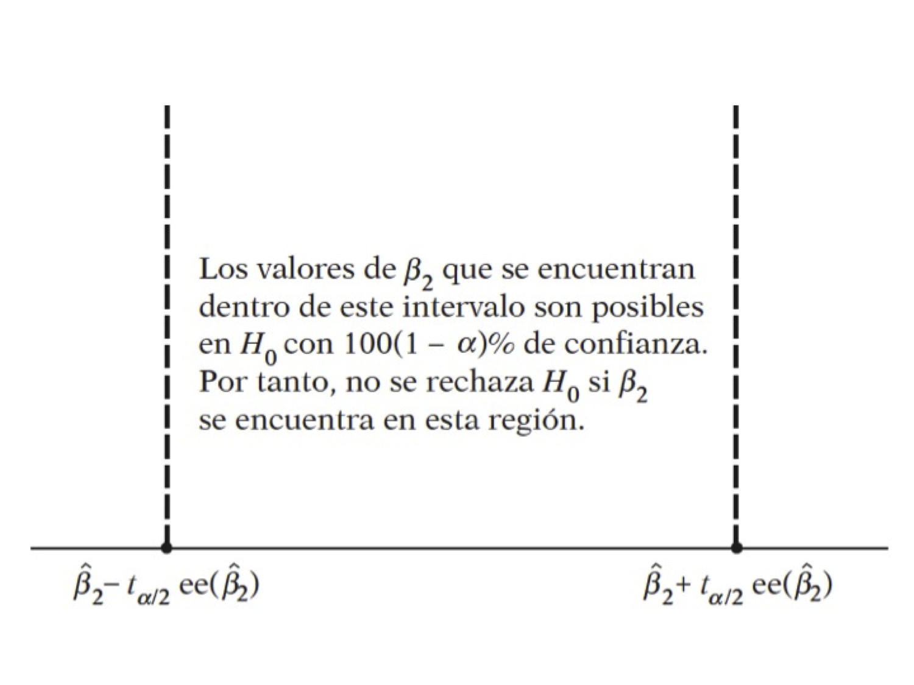
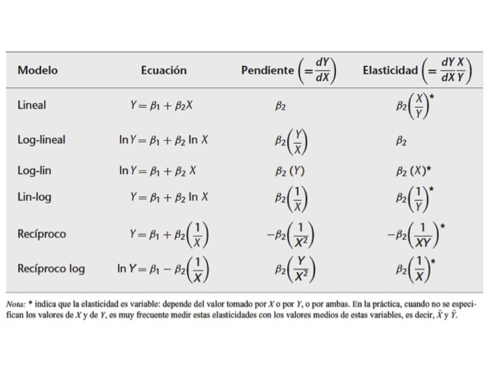
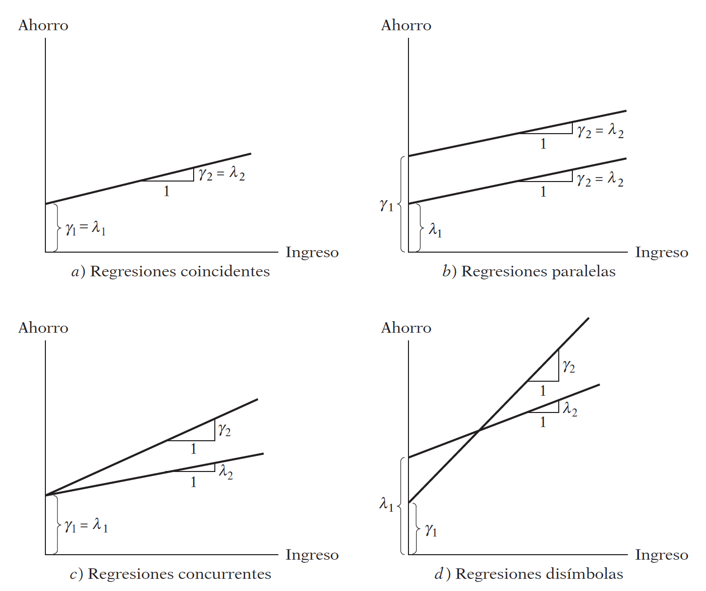

<script type="text/x-mathjax-config">
    MathJax.Hub.Config({ TeX: { equationNumbers: {autoNumber: "all"} } });
  </script>
---
<!--
La revisión metodológica aquí vertida se basa en [@Wang_2012].
-->

```{r setup, include=FALSE}
knitr::opts_chunk$set(echo = TRUE,warning = FALSE)
knitr::opts_knit$set(root.dir = normalizePath("/Users/victormoralesonate/Documents/Consultorias&Cursos/DataLectures")) 
```

# Regresión Lineal


## Una idea general

Abordemos las primeras ideas de regresión lineal a través de un ejemplo práctico:

- Abrir la `tabla 2.1`
- Creamos dos variables, Ingreso y Consumo Esperado

```{r}
ingresos <- seq(80,260,20)
consumoEsperado <- c(65,77,89,101,113,125,137,149,161,173)
```

Ahora:

- Generar un gráfico tipo línea entre ingresos y consumo esperado
- Superponer un gráfico tipo puntos  de $X$ e $Y$ (`tabla 2.1`) sobre el gráfico anterior
- Generar un gráfico tipo puntos $X$ e $Y$ en azul
- Superponer un gráfico tipo lineas de Ingresos y consumo esperado sobre el gráfico anterior en azul


```{r,echo=FALSE,warning=FALSE,message=FALSE}
familia <- read.csv(file="Tabla2_1.csv",sep=";",dec=".",header=T)
attach(familia)
names(familia)
cbind(ingresos,consumoEsperado) 
```


```{r}
par(mfrow=c(1,2))
plot(ingresos,consumoEsperado, type="l",main="Linea muestral \ny puntos poblacional") # la "s" en type, arroja un gráfico en escalera
points(X,Y)

#Primero poner los puntos y luego la línea para tener 
plot(X,Y,col="blue",main="Linea poblacional \ny puntos muestral")
lines(ingresos,consumoEsperado,col="blue") #Función de regresión poblacional (línea)
par(mfrow=c(1,1))
```


- ¿Qué hemos hecho?


$$
E(Y|X_i) = f(X_i) 
$$

$$
E(Y|X_i) = \beta_1+\beta_2X_i 
$$

$$
u_i = Y_i - E(Y|X_i) 
$$

$$
Y_i = E(Y|X_i) + u_i 
$$

- ¿Qué significa que sea lineal?

> El término regresión *lineal* siempre significará una regresión lineal en los parámetros; los $\beta$ (es decir, los parámetros) se elevan sólo a la primera potencia. Puede o no ser lineal en las variables explicativas $X$

Para evidenciar la factibilidad del uso de RL en este caso, vamos a obtener una muestra de la población:

- Creamos una variable indicadora para obtener una muestra `indice=seq(1,55,1)` 
- Usamos `sample` para obtener una muestra sin reemplazo del tamaño indicado: `muestra <- sample(indice,size=20)`
- Obtenemos el valor de la variable $X$ en la posición de *muestra* 
        + `ingreso.muestra <- X[muestra]`
        + `consumo.muestra <- Y[muestra]`


```{r}
indice <- seq(1,55,1)  
muestra <- sample( X ,size=20)
muestra <- sample(indice,size=20)
ingreso.muestra <- X[muestra]
consumo.muestra <- Y[muestra]
```


- Graficamos ingreso.muestra vs consumo.muestra
- Realizar una regresión lineal de las variables muestra:
      + `plot(ingreso.muestra,consumo.muestra)`
      + `ajuste.1=(lm(consumo.muestra\sim ingreso.muestra))`
      + `abline(coef(ajuste.1))`
- Generar una segunda muestra (muestra.2 por ejemplo) y comparar los coeficientes
- ¿Qué conclusiones puede sacar?


```{r}
plot(ingreso.muestra,consumo.muestra)
ajuste.1 <- (lm(consumo.muestra~ingreso.muestra))
ajuste.1
coef(ajuste.1)
abline(coef(ajuste.1))
```


### Regresión: Paso a paso

La función poblacional sería:

$$
Y_i = \beta_1 + \beta_2X_i+u_i
$$

Como no es observable, se usa la muestral


$$
Y_i=\hat{\beta}_1+\hat{\beta}_2X_i+\hat{u}_i
$$


$$
Y_i=\hat{Y}_i+\hat{u}_i
$$


$$
\hat{u}_i = Y_i-\hat{Y}_i
$$


$$
\hat{u}_i = Y_i- \hat{\beta}_1-\hat{\beta}_2X_i
$$


Es por esto que los residuos se obtienen a través de los betas:


$$\label{eq1}
\sum\hat{u}_i^2 =\sum (Y_i- \hat{\beta}_1-\hat{\beta}_2X_i)^2
$$


$$
\sum\hat{u}_i^2 =f(\hat{\beta}_1,\hat{\beta}_2)
$$


Diferenciando ([\eqref{eq1}]) se obtiene:

$$
 \hat{\beta}_2 = \frac{S_{xy}}{S_{xx}}
$$

$$
 \hat\beta_1 = \bar{Y} -  \hat\beta_2\bar{X}
$$
donde 
$$
S_{xx} = \sum_{i=1}^{n}x_i^2-n\bar{x}^2
$$

$$
S_{xy} = \sum_{i=1}^{n}x_i y_i-n\bar{x}\bar{y}
$$

Abrimos la `tabla3.2`, vamos a obtener:


```{r}
uu <- "https://raw.githubusercontent.com/vmoprojs/DataLectures/master/Tabla3_2.csv"

consumo <- read.csv(url(uu),sep=";",dec=".",header=TRUE)
attach(consumo)

media_x <- mean(X, na.rm=T)
media_y <- mean(Y, na.rm=T)

n <- length(X)*1

sumcuad_x <- sum(X*X)
sum_xy <- sum(X*Y)

beta_som <- (sum_xy-n*media_x*media_y)/
    (sumcuad_x-n*(media_x^2))
alpha_som  <- media_y-beta_som*media_x
```


- Verificamos lo anterior mediante:

```{r}
reg.1 <- (lm(Y~X))
coef(reg.1)
```

- Veamos cómo queda nuestra estimación:
```{r}
y.ajustado <- alpha_som+beta_som*X
head(cbind(X,y.ajustado))
```

- Gráficamente:

```{r}
plot(X,y.ajustado,main="Valores estimados")
abline(a=alpha_som,b=beta_som)
```

- Encontremos los residuos:

```{r}
y.ajustado=alpha_som+beta_som*X
e <- Y-y.ajustado
```

- Comparemos los resultados

```{r}
head(cbind(X,Y,y.ajustado,e))
```

- Veamos la media y la correlación

```{r}
mean(e) 
cor(e,X) 
```

- Hallemos el coeficiente de determinación o *bondad* de ajuste.

- Para ello necesitamos la suma de cuadrados total y la suma de cuadramos explicada 

```{r}
SCT <- sum((Y-media_y)^2)
SCE <- sum((y.ajustado-media_y)^2)
SCR <- sum(e^2)
R_2 <- SCE/SCT

summary(reg.1)
```


Pruebas de hipótesis:

$$
H_0:\beta_2=0
$$
$$
H_1:\beta_2\neq 0
$$




- Abrir la tabla 2.8


- Regresar el gasto total en el gasto en alimentos
- ¿Son los coeficientes diferentes de cero?
```{r}
t1 <- (0.43681-0)/0.07832
1-pt(t1,53)
```

- ¿Son los coeficientes diferentes de $0.5$?

```{r}
# H0: beta1 = 0.5
t2 <- (0.43681-0.5)/0.07832
(1-pt(abs(t2),53))
```


Interpretación de los coeficientes

- El coeficiente de la variable dependiente mide la tasa de cambio (derivada=pendiente) del modelo
- La interpretación suele ser *En promedio, el aumento de una unidad en la variable independiente produce un aumento/disminución de $\beta_{i}$ cantidad en la variable dependiente*
- Interprete la regresión anterior.


#### Práctica: Paridad del poder de compra

Abrir la tabla 5.9, las variables son:
```{r,echo=FALSE,warning=FALSE,message=FALSE}
uu <- "https://raw.githubusercontent.com/vmoprojs/DataLectures/master/Tabla5_9.csv"
datos <- read.csv(url(uu),sep=";",dec=".",header=TRUE)
attach(datos)
names(datos) 
```


- BMACLC: Big Mac Prices in Local Currency
- BMAC\$: Big Mac Prices in \$
- EXCH: Actual \$ Exchange Rate 4/17/2001
- PPP: Implied Purchasing-Power Parity of the Dollar: Local Price Divided by Price in United States
- LOCALC: Local Currency Under (-)/Over (+) Valuation Against \$, Percent

Empezamos con el buen `summary`. ¿Notan algo raro?


- Debemos limpiar los datos
```{r}
datos$EXCH[which(  EXCH  == -99999)] <- NA
datos$PPP[which(  PPP == -99999)] <- NA
datos$LOCALC[which(  LOCALC   ==-99999)] <- NA
```

Regresamos la paridad del poder de compra en la tasa de cambio

```{r}
reg1 <- lm(EXCH~PPP)
summary(reg1)

reg2 <- lm(EXCH[-13]~PPP[-13])
summary(reg2)

reg3 <- lm(log(EXCH)~log(PPP))
summary(reg3)
```


La PPA sostiene que con una unidad de moneda debe ser posible comprar la misma canasta de bienes en todos los países.


#### Práctica: Sueño

De la carpeta *Datos*, abrir `sleep.xls`

```{r}
uu <- "https://raw.githubusercontent.com/vmoprojs/DataLectures/master/sleep75.csv"
datos <- read.csv(url(uu), header = FALSE) 
```

agregamos los nombres:

```{r}
names (datos) <- c("age","black","case","clerical","construc","educ","earns74","gdhlth","inlf", "leis1", "leis2", "leis3", "smsa", "lhrwage", "lothinc", "male", "marr", "prot", "rlxall", "selfe", "sleep", "slpnaps", "south", "spsepay", "spwrk75", "totwrk" , "union" , "worknrm" , "workscnd", "exper" , "yngkid","yrsmarr", "hrwage", "agesq")    
```


Veamos los datos gráficamente y corramos la regresión:

```{r}
attach(datos)
#totwrk minutos trabajados por semana
#sleep minutos dormidos por semana
plot(totwrk,sleep)
dormir <- lm(sleep~totwrk)
summary(dormir)
```


- ¿Existe una relación entre estas variables?
- Interprete el modelo

Intervalo de confianza para $\beta_2$ y veamos los residuos

```{r}
-0.15084-2*c(-0.01677,0.01677)

hist(resid(dormir),freq=F)
lines(density(resid(dormir)))
```

Derivaciones del modelo



## Transformaciones Lineales


Abrir la `tabla 31.3`, regresar el ingreso per cápita en el número de celulares por cada 100 personas:

```{r,echo=FALSE,warning=FALSE,message=FALSE}
uu <- "https://raw.githubusercontent.com/vmoprojs/DataLectures/master/Table%2031_3.csv"
datos <- read.csv(url(uu),sep=";",dec=".",header=TRUE)
attach(datos)
```


```{r}
reg.1 <- lm(Cellphone ~ Pcapincome)
summary(reg.1)

plot(Pcapincome,Cellphone)
abline(coef(reg.1))
```


### Modelo recíproco

Abrir la `tabla 6.4`, regresar el Producto Nacional Bruto (PGNP) en la tasa de mortalidad (CM).

```{r,echo=FALSE,warning=FALSE,message=FALSE}
uu <- "https://raw.githubusercontent.com/vmoprojs/DataLectures/master/tabla_6_4.csv"
datos <- read.csv(url(uu),sep=";",dec=".",header=TRUE)
attach(datos)
names(datos)
```


```{r}
plot(CM~ PGNP)

reg1 <- lm(CM ~ PGNP)
summary(reg1)

reg2 <- lm(CM~I(1/PGNP))
summary(reg2)
```


### Modelo log-lineal

Abrir los datos `ceosal2.xls`,

```{r,echo=TRUE,warning=FALSE,message=FALSE}
uu <- "https://raw.githubusercontent.com/vmoprojs/DataLectures/master/ceosal2.csv"
datos <- read.csv(url(uu), header = FALSE) 
names(datos) = c("salary", "age", "college", "grad", "comten", "ceoten", "sales", "profits","mktval", "lsalary", "lsales", "lmktval", "comtensq", "ceotensq", "profmarg")
attach(datos)
```

Regresar la antigüedad del CEO en el logaritmo del salario.

```{r}
summary(lm(lsalary~ceoten))
```

- Hay una probabilidad de equivocarnos del 12.84% si rechazamos la hipótesis nula
- No hay evidencia de la entiguedad tenga relación con el salario
- Los CEO con 0 a?os de antiguedad entran ganando `exp(6.505)=668.4757` miles de USD `exp(6.505)`


### Regresión a través del origen

Abrir la `tabla 6.1`, regresar X (rendimientos excedentes de un índice acciones del sector de bienes de consumo cíclico) en Y (rendimientos excedentes de un índice acciones de todo el mercado de valores en el Reino Unido)

```{r,echo=FALSE,message=FALSE,warning=FALSE}
uu <- "https://raw.githubusercontent.com/vmoprojs/DataLectures/master/Table%206_1.csv"
datos <- read.csv(url(uu),sep=";",dec=".",header=TRUE)
attach(datos)
```


```{r}
lmod1 <- lm(Y~ -1 + X)
summary(lmod1)

lmod2 <- lm(Y~  X)
summary(lmod2)
```


- El coeficiente de la pendiente no es sólo estadísticamente significativo, sino que es significativamente mayor que 1 (¿puede verificar esto?).
- Si un coeficiente Beta es mayor que 1, se dice que ese título (en este caso, un portafolios de 104 acciones) es volátil

## Regresión Lineal Múltiple

Abrir los datos `hprice1.xls`. Correr los siguientes modelos e interpretarlos:

```{r,echo=TRUE,warning=FALSE,message=FALSE}
uu <- "https://raw.githubusercontent.com/vmoprojs/DataLectures/master/hprice1.csv"
precios <- read.csv(url(uu), header = FALSE) 

names(precios)=c("price"   ,  "assess"  , 
                 "bdrms"  ,   "lotsize"  ,
                 "sqrft"   ,  "colonial",
                 "lprice"  ,  "lassess" ,
                 "llotsize" , "lsqrft")

attach(precios)
```


```{r}
modelo1 <- lm(lprice ~ lassess + llotsize + lsqrft + bdrms)
summary(modelo1)

modelo2 <- lm(lprice ~ llotsize + lsqrft + bdrms)
summary(modelo2)

modelo3 <- lm(lprice ~  bdrms)
summary(modelo3)
```


#### Predicción

```{r}
pairs(cbind(lprice,llotsize , lsqrft , bdrms), col=rainbow(5))
```


- Forma 1 de predicción:

```{r}
tamano_casa <- 8000
cuartos <- 4
tamano_lote <- 2100

coef(modelo2)
valores <- c(1,log(tamano_lote),log(tamano_casa),cuartos)
valores
sum(valores*coef(modelo2))
exp(sum(valores*coef(modelo2)))
```

- Forma 2 de predicción:

```{r}
datos.nuevos <- data.frame(llotsize=log(2100),lsqrft=log(8000),bdrms=4)
predict.lm(modelo2,newdata=datos.nuevos,se.fit=T)
```


### RLM: Cobb-Douglas


El modelo:

$$
Y_i = \beta_1X_{2i}^{\beta_2}X_{3i}^{\beta_3}e^{u_i}
$$

donde 

-   $Y$: producción
-   $X_2$: insumo trabajo
-   $X_3$: insumo capital
-   $u$: término de perturbación
-   $e$: base del logaritmo


Notemos que el modelo es multiplicativo, si tomamos la derivada obetenemos un modelo más famliar respecto a la regresión lineal múltiple:

$$
lnY_i = ln\beta_1 + \beta_2ln(X_{2i})+ \beta_3ln(X_{3i}) + u_i
$$


La interpretación de los coeficientes es [@gujarati2010econometria]:

1. $\beta_2$ es la elasticidad (parcial) de la producción respecto del insumo trabajo, es decir, mide el cambio porcentual en la producción debido a una variación de 1% en el insumo trabajo, con el insumo capital constante.

2. De igual forma, $\beta_3$ es la elasticidad (parcial) de la producción respecto del insumo capital, con el insumo trabajo constante.

3. La suma ($\beta_2+\beta_3$) da información sobre los rendimientos a escala, es decir, la respuesta de la producción a un cambio proporcional en los insumos. Si esta suma es 1, existen rendimientos constantes a escala, es decir, la duplicación de los insumos duplica la producción, la triplicación de los insumos la triplica, y así sucesivamente. Si la suma es menor que 1, existen rendimientos decrecientes a escala: al duplicar los insumos, la producción crece en menos del doble. Por
último, si la suma es mayor que 1, hay rendimientos crecientes a escala; la duplicación de los insumos aumenta la producción en más del doble.


Abrir la `tabla 7.3`. Regresar las horas de trabajo ($X_2$)  e Inversión de Capital ($X_3$) en el Valor Agregado ($Y$)

```{r,echo=FALSE,message=FALSE,warning=FALSE}
uu <- "https://raw.githubusercontent.com/vmoprojs/DataLectures/master/tabla7_3.csv"
# datos <- read.csv(file="tabla7_3.csv",sep=";",dec=".",header=TRUE)
datos <- read.csv(url(uu),sep=";",dec=".",header=TRUE)
attach(datos)
```


```{r}
W <- log(X2)

K <- log(X3)

LY <- log(Y)

reg.1 <- lm(LY~W+K)
summary(reg.1)
aov(reg.1)
```

- Las elasticidades de la producción respecto del trabajo y el capital fueron 1.49 y 0.48.


Ahora, si existen rendimientos constantes a escala (un cambio equi proporcional en la producción ante un cambio equiproporcional en los insumos), la teoría económica sugeriría que: 

$$
\beta_2 +\beta_3 = 1
$$


```{r}
LY_K <- log(Y/X3)
W_K <- log(X2/X3)


reg.2 <- lm(LY_K~W_K)
summary(reg.2)
aov(reg.2)
```


**¿Se cumple la hipótesis nula? ¿Existen rendimientos constantes de escala?**

Una forma de responder a la pregunta es mediante la prueba $t$, para $Ho: \beta_2 +\beta_3 = 1$, tenemos

$$
t = \frac{(\hat{\beta}_2+\hat{\beta}_3)-(\beta_2+\beta_3)}{ee(\hat{\beta}_2+\hat{\beta}_3)}
$$
$$
t = \frac{(\hat{\beta}_2+\hat{\beta}_3)-1}{\sqrt{var(\hat{\beta}_2)+var(\hat{\beta}_3)+2cov(\hat{\beta}_2,\hat{\beta}_3})}
$$
donde la información nececesaria para obtener $cov(\hat{\beta}_2,\hat{\beta}_3)$ en `R` es `vcov(fit.model)` y `fit.model` es el ajuste del modelo.

Otra forma de hacer la prueba es mediante el estadístico $F$:

$$
F = \frac{Q_2/gl}{Q_4/gl}
$$
$$
F = \frac{(SCE_{R}-SCE_{NR})/m}{SCR_{NR}/(n-k)}
$$

donde $m$ es el número de restricciones lineales y $k$ es el número de parámetros de la regresión no restringida.

```{r}
SCRNR <- 0.0671410  
SCRRes <- 0.09145854 
numero_rest <- 1
grad <- 12

est_F <- ((SCRRes-SCRNR)/numero_rest)/(SCRNR/grad)
est_F

valor.p <- 1-pf(est_F,1,12)
valor.p
```


No se tiene suficiente evidencia para rechazar la hipótesis nula de que sea una economía de escala.


Notemos que existe una relación directa entre el coeficiente de determinación o bondad de ajuste $R^2$ y $F$. En primero lugar, recordemos la descomposición de los errores:

$$
SCT = SCE + SCR
$$

$$
\sum_{i=1}^{n}(Y-\bar{Y})^2 = \sum_{i=1}^{n}(\hat{Y}-\bar{Y})^2 + \sum_{i=1}^{n}(\hat{u})^2
$$

De cuyos elementos podemos obtener tanto $R^2$ como $F$:

$$
R^2 = \frac{SCE}{SCT}
$$

$$
R^2 = \frac{SCE/(k-1)}{SCT/(n-k)}
$$

donde $k$ es el número de variables (incluido el intercepto) y sigue una distribución $F$ con $k-1$ y $n-k$ grados de libertad.

### RLM: Dicotómicas

Abrir la `tabla 9.1`. ¿Hay alguna diferencia entre la ubicación del estado en los salarios?

```{r,echo=FALSE,message=FALSE,warning=FALSE}
uu <- "https://raw.githubusercontent.com/vmoprojs/DataLectures/master/Table%209_1.csv"
datos <- read.csv(url(uu),sep=";",dec=".",header=TRUE)
# datos <- read.csv(file="Table 9_1.csv",sep=";",dec=".",header=TRUE)
attach(datos)
names(datos)
```

-  "State"   
-  "Salary"  salario prmedio de los profesores 
-  "Spending" gasto promedio en cada estudiante
-  "D2"     1 si el estado se encuentra en el norte este/centr de EEUU
-  "D3"     1 si el estado se encuentra en el Sur de EEUU
- D1 podria ser lo que no es ni D2 ni D3 (0,0)

```{r}
reg1 <- lm(Salary~D2+D3)
summary(reg1)
```

Esto es un análisis de varianza, se analiza la var continua (salarios) con factores (categorias)

¿Hay alguna diferencia entre la ubicación del estado en los salarios?

```{r}
reg2 <- lm(Salary~Spending+D2+D3)
summary(reg2)
```

- Esto es un análisis de la varianza con  covariadas (el covariado es el gasto por estudiante). 
- Se quiere mostrar que en los estados del sur se gana menos que los otros: 

$$
H_0: \beta_3 >= 0
$$
$$
H_a: \beta_3 <  0
$$

### Diferencias en medias, enfoque RLM

Abrir los datos wage1.xls. Correr los modelos. Se desea saber si el género tiene relación con el salario y en qué medida.

```{r,echo=TRUE,warning=FALSE,message=FALSE}
uu <- "https://raw.githubusercontent.com/vmoprojs/DataLectures/master/wage1.csv"
salarios <- read.csv(url(uu), header = FALSE) 

names(salarios) <- c("wage", "educ", "exper", "tenure", "nonwhite", "female", "married",
                     "numdep", "smsa", "northcen", "south", "west", "construc", "ndurman",
                     "trcommpu", "trade", "services",  "profserv", "profocc", "clerocc",
                     "servocc", "lwage", "expersq", "tenursq")
attach(salarios)
```

```{r}
reg3 <- lm(wage~female)
summary(reg3)

reg4 <- lm(wage~female + educ+ exper + tenure)
summary(reg4)
```


- La hipotesis es que saber si el coeficiente de female es menor a cero
- Se nota que es menor, 
- Tomando en cuenta, educacion experiencia y edad, en promedio a la mujer le pagan 1.81 menos

### RLM: Educación con insumos

Abrir los datos gpa1.xls. Correr los modelos.

- ¿Afecta el promedio el tener o no una computadora?

```{r,echo=TRUE,message=FALSE,warning=FALSE}
uu <- "https://raw.githubusercontent.com/vmoprojs/DataLectures/master/gpa1.csv"
datosgpa <- read.csv(url(uu), header = FALSE) 

names(datosgpa) <- c("age",  "soph",  "junior",    "senior",	"senior5",	"male",	"campus",	"business",	"engineer",	"colGPA",	"hsGPA",	"ACT",	"job19",	"job20",	"drive",	"bike",	"walk",	"voluntr",	"PC",	"greek",	"car",	"siblings",	"bgfriend",	"clubs",	"skipped",	"alcohol",	"gradMI",	"fathcoll",	"mothcoll")
attach(datosgpa)
```


Realizamos la regresión lineal:

```{r}
reg4 <- lm(colGPA ~ PC )
summary(reg4)

reg5 <- lm(colGPA~ PC + hsGPA + ACT)
summary(reg5)

```


### RLM: Cambio estructural

>Cuando utilizamos un modelo de regresión que implica series de tiempo, tal vez se dé un cambio estructural en la relación entre la regresada Y y las regresoras. Por cambio estructural nos referimos a que los valores de los parámetros del modelo no permanecen constantes a lo largo de todo el periodo (@gujarati2010econometria)


La tasa de desempleo civil alcanzó 9.7%,

la más alta desde 1948. Un suceso como éste pudo perturbar la relación entre el ahorro y el IPD. Para ver si lo anterior sucedió, dividamos la muestra en dos periodos: 1970-1981 y 1982-1995, antes y después de la recesión de 1982.


Ahora tenemos tres posibles regresiones:

$$
\text{1970-1981: } Y_t=\lambda_1+\lambda_2X_t+u_{1t}\label{chow1}
$$

$$
\text{1982-1995: } Y_t=\gamma_1+\gamma_2X_t+u_{2t}\label{chow2}
$$


$$
\text{1970-1995: } Y_t=\alpha_1+\alpha_2X_t+u_{2t}
$$

De los períodos parciales se desprende cuatro posibilidades:




Para evaluar si hay diferencias, podemos utilizar los modelos de regresión con variables dicotómicas:

$$
Y_t = \alpha_1+\alpha_2D_t+\beta_1X_t+\beta_2(D_tX_t)+u_t\label{chow3}
$$

donde 


- $Y$: ahorro
- $X$: ingreso
- $t$: tiempo
- $D$: 1 para el período 1982-1995, 0 en otro caso.


La variable dicotómica de la ecuacuión $\eqref{chow3}$ es quien me permite estimar las ecuaciones $\eqref{chow1}$ y $\eqref{chow2}$ al *mismo tiempo*. Es decir:


Función de ahorros medios para 1970-1981:

$$
E(Y_t|D_t=0,X_t) = \alpha_1+\beta_1X_t
$$

Función de ahorros medios para 1982-1995:

$$
E(Y_t|D_t=1,X_t) = (\alpha_1+\alpha_2)+(\beta_1+\beta_2)X_t
$$

Notemos que se trata de las mismas funciones que en $\eqref{chow1}$ y $\eqref{chow2}$, con

- $\lambda_1=\alpha_1$
- $\lambda_2=\alpha_2$
- $\gamma_1=(\alpha_1+\alpha_2)$
- $\gamma_2=(\beta_1+\beta_2)$


Abrir los `datos 8.9`. Veamos las variables gráficamente:

```{r,echo=FALSE,message=FALSE,warning=FALSE}
uu <- "https://raw.githubusercontent.com/vmoprojs/DataLectures/master/tabla_8_9.csv"

datos <- read.csv(url(uu),sep=";",dec=".",header=TRUE)
attach(datos)
names(datos)
```


```{r}
par(mfrow = c(1,2))
plot(INCOME,SAVINGS,main="Ahorro VS Ingresos")
plot(YEAR,SAVINGS,main="Ahorro VS Tiempo",t="l")
abline(v=1981,col ="red")
par(mfrow = c(1,1))
```

¿Hubo algún cambio en la relación entre ingreso y ahorro en el 80?

- Hay varias formas de hacer la prueba, la mas fácil es mediante variables dicotómicas

```{r}
ajuste_chow <- lm(SAVINGS~INCOME)
summary(ajuste_chow)

cambio <- (YEAR>1981)*1

ajuste_chow <- lm(SAVINGS~INCOME+cambio)
summary(ajuste_chow)
```

Veamos el modelo en términos de interacciones y la matriz de diseño:

```{r}
ajuste_chow1 <- lm(SAVINGS~INCOME+cambio+INCOME*cambio, x = TRUE)
summary(ajuste_chow1)
ajuste_chow1$x
```


# Referencias