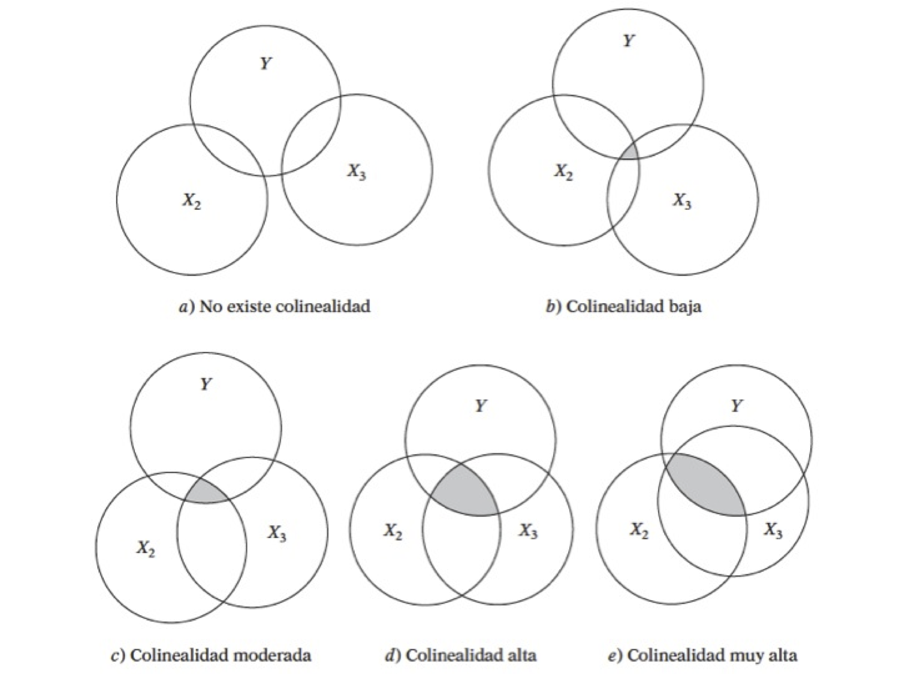
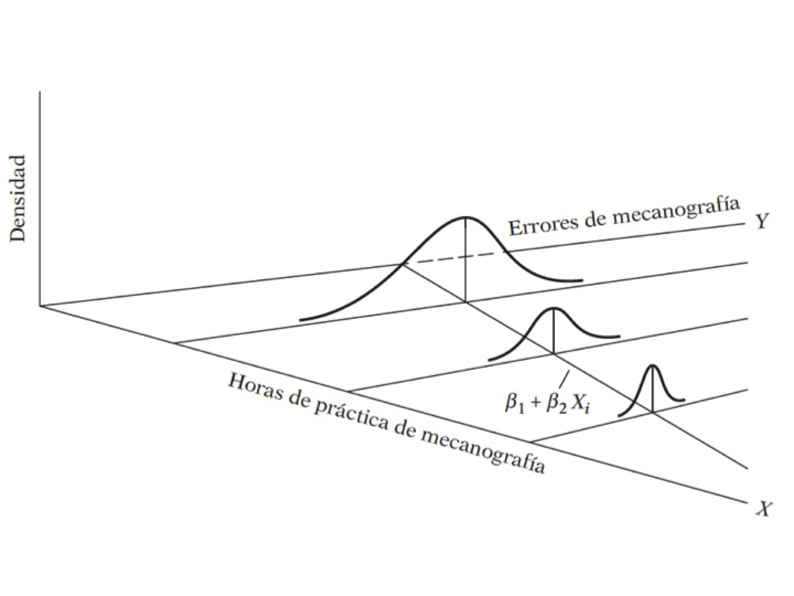

```{r setup, include=FALSE}
knitr::opts_chunk$set(echo = TRUE,warning = FALSE)
knitr::opts_knit$set(root.dir = normalizePath("/Users/victormoralesonate/Documents/Consultorias&Cursos/DataLectures")) 
```


<!--
La revisión metodológica aquí vertida se basa en [@Wang_2012].
-->

# RLM: Supuestos


## Multicolinealidad

####El problema:

$$
\hat{\beta}=(X'X)^{-1}X'Y
$$
- Se tiene un problema en cuanto a la transpuesta de la matriz $(X'X)$

- Perfecta: Si se tiene este tipo, el modelo simplemente no toma en cuenta esta variable
- Imperfecta: El cáclulo de la inversa es computacionalmente exigente



#### Posibles causas

- El método de recolección de información
- Restricciones en el modelo o en la población objeto de muestreo
- Especificación del modelo	
- Un modelo sobredetermindado
- Series de tiempo

#### ¿Cuál es la naturaleza de la multicolinealidad?

**Causas**
- ¿Cuáles son sus consecuencias prácticas?

**Incidencia en los errores estándar y sensibilidad**

- ¿Cómo se detecta?

**Pruebas**


#### ¿Qué medidas pueden tomarse para aliviar el problema de multicolinealidad?\\

- No hacer nada
- Eliminar variables
- Transformación de variables
- Añadir datos a la muestra
- Componentes principales, factores, entre otros

#### ¿Cómo se detecta?

- Un $R^{2}$ elevado pero con pocas razones $t$ significativas
- Regresiones auxiliares (Pruebas de Klein)
- Factor de inflación de la varianza
$$
VIF = \frac{1}{(1-R^2)}
$$

#### Ejemplo 1

- Haremos uso del paquete AER
- Abrir la tabla 10.8
- Ajusta el modelo

donde 

- $X_1$ índice implícito de deflación de precios para el PIB, 
- $X_2$ es el PIB (en millones de dólares), 
- $X_3$ número de desempleados (en miles), 
- $X_4$ número de personas enlistadas en las fuerzas armadas, 
- $X_5$ población no institucionalizada mayor de 14 años de edad
- $X_6$ año (igual a 1 para 1947, 2 para 1948 y 16 para 1962).

$$
Y_{i} = \beta_{0}+\beta_{1}X_{1}+\beta_{2}X_{2}+\beta_{3}X_{3} + \beta_{4}X_{4}+\beta_{5}X_{5}+u_{i}\nonumber
$$

- Analice los resultados


```{r,echo=TRUE,warning=FALSE,message=FALSE}
uu <- "https://raw.githubusercontent.com/vmoprojs/DataLectures/master/tabla10_8.csv"
datos<- read.csv(url(uu),sep=";",header=TRUE)
attach(datos)
```

Agreguemos el tiempo:
 - Las correlaciones muy altas también suelen ser síntoma de multicolinealidad

```{r}
ajuste.2 <- lm(Y~X1+X2+X3+X4+X5+TIME)
summary(ajuste.2)

cor(cbind(X1,X2,X3,X4,X5,TIME))
```

- Prueba de Klein: Se basa en realizar regresiones auxiliares de *todas contra todas* las variables regresoras.
- Si el $R^{2}$ de la regresión aux es mayor que la global, esa variable regresora podría ser la que genera multicolinealidad
- ¿Cuántas regresiones auxiliares se tiene en un modelo en general?


Regresemos una de las variables
```{r}
ajuste.3<- lm(X1~X2+X3+X4+X5+TIME)
summary(ajuste.3)

tolerancia<-1-0.9923
```


**Factor de inflación de la varianza**

Si este valor es mucho mayor que 10 y se podría concluir que si hay multicolinealidad

```{r}
vif <- 1/tolerancia
vif
```

Ahora vamos a usar el paquete `AER`:
```{r,message=FALSE,warning=FALSE}
library(AER)
```


```{r}
vif1 <- vif(ajuste.2)
Raux <- (vif1-1)/vif1
Rglobal <- 0.9955

Rglobal-Raux
```


Se podría no hacer nada ante este problema. O se puede tratar con transformaciones. Deflactamos el PIB: `PIB_REAL <- X2/X1`

```{r}
# La variable X5 (población) 
# esta correlacionada con el tiempo
PIB_REAL <- X2/X1
ajuste.4<-lm(Y~PIB_REAL+X3+X4)
summary(ajuste.4)
vif(ajuste.4)

ajuste.5<-lm(Y~PIB_REAL+X3+X4)
summary(ajuste.5)
vif(ajuste.5)
```

## Heterocedasticidad

Ocurre cuando la varianza no es constante.

¿Cuál es la naturaleza de la heterocedasticidad?

- Modelos de aprendizaje de los errores: con el paso del tiempo, las personas cometen menos errores de comportamiento. Es decir que la varianza disminuye.
- Ingreso direccional: Es probable que la varianza aumente con el ingreso dado que el aumento del ingreso se tiene más opciones del cómo disponer de él.




- Técnicas de recolección de datos: si la técnica mejora, es probable que la varianza se reduzca.
- Datos atípicos o aberrantes: Sensibilidad en las estimaciones 
- Especificaciones del modelo: Omisión de variables importantes en el modelo.
- Asimentría: Surge a partir de la distribución de una o más regresoras en el modelo. Ejemplo: Distribución del ingreso *generalmente inequitativo*


#### ¿Cómo detectarla?

Método gráfico


Veamos las pruebas de detección en un ejemplo

- Abrir la base de datos *wage1* de Wooldrigde

```{r,echo=TRUE,message=FALSE,warning=FALSE}
uu <- "https://raw.githubusercontent.com/vmoprojs/DataLectures/master/wage1.csv"
datos <- read.csv(url(uu),header=FALSE)
names(datos) <- c("wage",  "educ",  "exper",  "tenure",    
               "nonwhite",	"female",	"married",	
               "numdep",	"smsa",	"northcen",	"south",
               "west",	"construc",	"ndurman",	"trcommpu",
               "trade",	"services",	"profserv",	"profocc",
               "clerocc",	"servocc",	"lwage",	"expersq",
               "tenursq")
attach(datos)

casados = (1-female)*married  # female 1=mujer  married=1 casado
casadas = (female)*married
solteras = (female)*(1-married)
solteros = (1-female)*(1-married)
```

- Correr el modelo
$$
lwage = \beta_{0}+\beta_{1}casados+\beta_{2}casadas+\beta_{3}solteras +\beta_{4}educ+\beta_{5}exper+\beta_{6}expersq +\beta_{7}tenure+\beta_{8}tenuresq+u_{i}
$$
- Hacer un gráfico de los valores  estimados y los residuos al cuadrado


### Prueba de Breusch Pagan

- Correr un modelo de los residuos al cuadrado regresado en las variables explicativas del modelo global.
$$
sqresid = \beta_{0}+\beta_{1}casados+\beta_{2}casadas+\beta_{3}solteras +\beta_{4}educ+\beta_{5}exper+\beta_{6}expersq +\beta_{7}tenure+\beta_{8}tenuresq+u_{i}
$$
- `bptest(objeto)`: si el pvalor es inferior a $0.05$, `Ho: Homocedasticidad`


El códgio en R sería:

```{r,message=FALSE,warning=FALSE}
ajuste1 <- lm(lwage~casados+casadas+solteras+educ+exper+
                  expersq+tenure+tenursq)

summary(ajuste1)
residuos <- resid(ajuste1)
sqresid <- residuos^2
y_techo <- fitted(ajuste1)
plot(y_techo,sqresid) 

plot(fitted(ajuste1),resid(ajuste1))

# Usando el "default" de R:
par(mfrow=c(2,2))
plot(ajuste1)
par(mfrow=c(1,1))


library(sandwich)
library(lmtest)
#install.packages("lmSupport")
library(lmSupport)

# Test para ver si hay heterocedasticidad
residuos <- resid(ajuste1)
sqresid <- (residuos)^2
ajuste2 <- lm(sqresid~casados+casadas+solteras+educ+exper+expersq+tenure+tenursq)
summary(ajuste2)


# F =1.662 y pvalue=0.105 NO EXISTE HETEROCEDASTICIDAD
#Breusch-Pagan test

'bptest es igual a hettest en STATA'
bptest(ajuste1)
```

## Autocorrelación


- ¿Cuál es la naturaleza de la autocorrelación?
- ¿Cuáles son las consecuencias teóricas y prácticas de la autocorrelación?
- ¿Cómo remediar el problema de la autocorrelación?

> *Autocorrelación:* correlación entre miembros de series de observaciones ordenadas en el tiempo [como en datos de series de tiempo] o en el espacio [como en datos de corte transversal]:

$$
E(u_i,u_j) \neq 0 \\
i \neq j
$$
El supuesto es:
$$
cov(u_i,u_j|x_i,x_j)  = E(u_i,u_j) = 0 \\
i \neq j
$$


- Datos atípicos o aberrantes: Sensibilidad en las estimaciones 
- Especificaciones del modelo: Omisión de variables importantes en el modelo.
- Asimentría: Surge a partir de la distribución de una o más regresoras en el modelo. Ejemplo: Distribución del ingreso *generalmente inequitativo*


#### Cómo detectarla sesgos de especificación

Método gráfico


Veamos las pruebas de detección en un ejemplo

#### Ejemplo

Abrir la `tabla 12.4`. Veamos los datos en forma gráfica, y corramos el modelo:

- Y, índices de remuneración real por hora
- X, producción por hora X

```{r,echo=TRUE,warning=FALSE,message=FALSE}
uu <- "https://raw.githubusercontent.com/vmoprojs/DataLectures/master/tabla12_4.csv"
datos1<- read.csv(url(uu), sep=";",dec=".", header=T)
attach(datos1)
```

```{r}
#Indice de compensacion real (salario real)
plot(X,Y)

ajuste.indice<-lm(Y~X)
summary(ajuste.indice)
```


Revisemos si hay autocorelación:

```{r}
residuos<- resid(ajuste.indice)
plot(residuos,t="l",xlab="Tiempo")
par(mfrow = c(2,2))
plot(ajuste.indice)
par(mfrow = c(1,1))
```

- Los datos NO DEBEN TENER UN PATRON (si tienen patron, algo anda mal)
- En este caso se tiene un curva cuadrática, el modelo podría estar mal especificado
- Podría ser que el modelo no se lineal o estar correlacionado


Veamos si se trata de una función cuadrática y cúbica

```{r}
ajuste2 <- lm(Y~X+I(X^2))
summary(ajuste2)

ajuste3 <- lm(Y~X+I(X^2)+I(X^3))
summary(ajuste3)
```


Nos quedamos con el ajuste 2

El gráfico de los  val ajustados, muestra que se ha eliminado el patron inicial

```{r}
par(mfrow = c(2,2))
plot(ajuste2)  
par(mfrow = c(1,1))

residuos2 <- resid(ajuste2)
plot(residuos2,t="l",xlab="Tiempo")
points(residuos2)
abline(h=0,col="blue")
```


Cómo debe ser el gráfico

```{r}
aleatorios=rnorm(40,0,1)
plot(aleatorios,t="l",xlab="Tiempo")
points(aleatorios)
abline(h=0,col="blue")
```

¿Se parece?

Ejemplo: Pruebas


> Ho: No hay autocorrelación


```{r}
dwtest(ajuste2)
```

¿Cuál es la conclusión?

Otra prueba:

```{r}
# Ajuste Breuch Godfrey (Ho: No hay autocorrelación)
bgtest(ajuste2,order=4)
```

