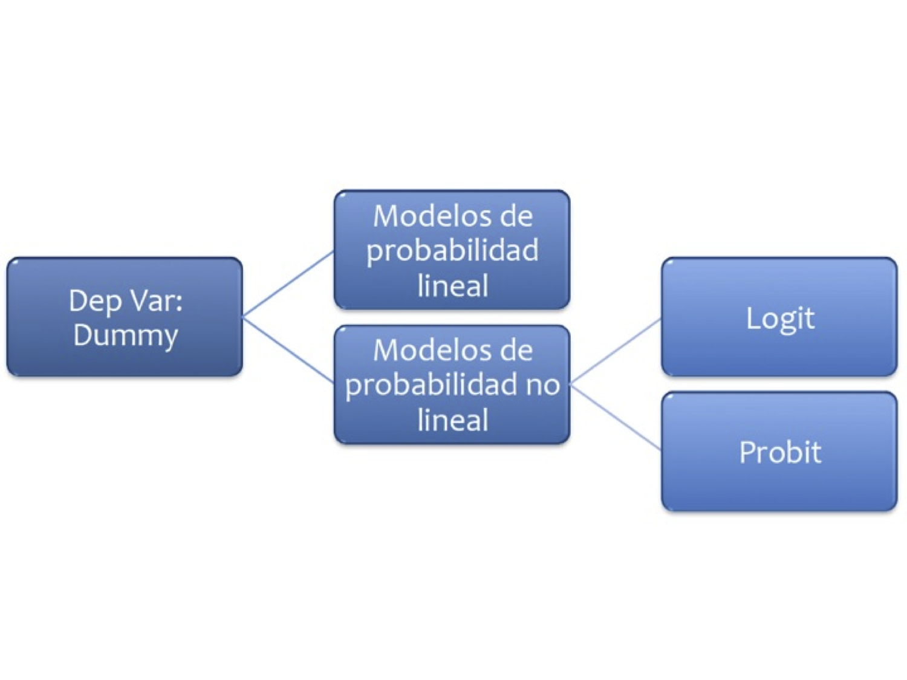
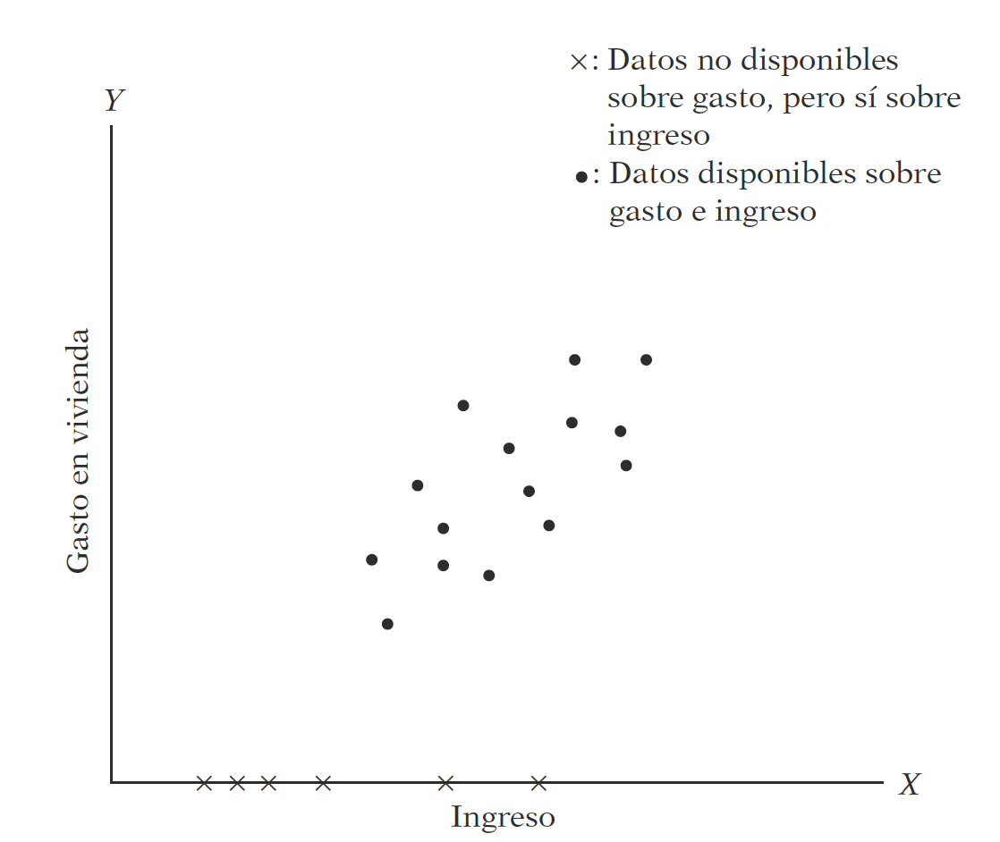

```{r setup, include=FALSE}
knitr::opts_chunk$set(echo = TRUE,warning = FALSE,message = FALSE)
knitr::opts_knit$set(root.dir = normalizePath("/Users/victormoralesonate/Documents/Consultorias&Cursos/DataLectures")) 
```


<!--
La revisión metodológica aquí vertida se basa en [@Wang_2012].
-->

# Probabilidad lineal

En este caso la variable dependiente es una dummy



Se trata de modelos del tipo:

\begin{eqnarray}
D_{i} = \beta_{0}+\beta_{1}X_{1i}+u_{i} \nonumber
\end{eqnarray}


Veamos un ejemplo: Abrir la base `MROZ` de Wooldridge y ajuste el modelo:

$$
inlf=\beta_0nwifeinc+\beta_1educ + \beta_2exper +\beta_3expersq + \beta_4age + \beta_5kidslt6 + \beta_6kidsge6
$$


En R:

```{r}
uu <- "https://raw.githubusercontent.com/vmoprojs/DataLectures/master/mroz.csv"
datos <- read.csv(url(uu),header=FALSE,na.strings = ".")
# str(datos)

# De ser necesario, quitar comentario y ejecutar:
# datos$V1[1] <- 1
# datos$V1 <- as.numeric(as.character(datos$V1))

names(datos) <- c("inlf","hours",  "kidslt6", "kidsge6", 
               "age", "educ",  "wage",    
               "repwage",
               "hushrs"  ,  "husage", "huseduc" ,
               "huswage"  , "faminc", "mtr","motheduc",
               "fatheduc" , "unem"    ,  "city"     , "exper"   ,  "nwifeinc" , "lwage" ,    "expersq" )
attach(datos)

reg1 <- lm(inlf~nwifeinc+educ + exper +
            expersq + age + kidslt6 + 
            kidsge6)
summary(reg1)
```

¿Qué hemos ajustado?

```{r}
plot(inlf~educ)
abline(coef(lm(inlf~educ)))
```

- Excepto *kidsge6* los coeficientes son significativos.
- Se introdujo la experiencia cuadrática para capturar un efecto decreciente en el efecto deseado (inlf). ¿Cómo lo interpretamos?

`.039 - 2(.0006)exper = 0.39 - .0012exper`

- El punto en el que la experiencia ya no tiene efecto en *inlf* es $.039/.0012 = 32.5$. ¿Cuantos elementos de la muestra tienen más de 32 años de experiencia?


Se añade exper al cuadrado porque queremos dar la posibilidad que los años adicionales de expericnecia contribuyan con un efecto decreciente.

Trabajemos ahora con la predicción, y revisemos el resultado:

```{r}
prediccion <- predict(reg1)
head(cbind(inlf,prediccion))
summary(prediccion)
```

¿Qué podemos notar?


- Existen valores mayores a 1 e inferiores a 0.
- $R^{2}$ ya no es interpretable en estas regresiones
- Usaremos una probabilidad de ocurrencia, digamos 0.5

```{r}
prediccion.inlf <- (prediccion>=0.5)*1
head(cbind(inlf,prediccion,prediccion.inlf))
sum(inlf)-sum(prediccion.inlf)
```

- Viendo la tabla, ¿cuál será la tasa de predicción del modelo actual?

```{r}
tabla1 <- table(inlf,prediccion.inlf)
tabla1
porcentaje.correcto <- (tabla1[1,1]+tabla1[2,2])/length(prediccion)
porcentaje.correcto
```


Para resolver el problema anterior de los valores fuera del intervalo 0-1, se propone una función diferente.

# Logit

La regresión logística puede entenderse simplemente como encontrar los parámtros $\beta$ que mejor asjuten:

$$
y={\begin{cases}1&\beta_{1}+\beta_{2}X_{1}+\cdots+\beta_{k}X_{k}+u >0\\0&{\text{en otro caso}}\end{cases}}
$$

Donde se asume que el error tiene una [distribución logística estándar](https://es.wikipedia.org/wiki/Distribuci%C3%B3n_log%C3%ADstica)

$$
{\displaystyle f(x;\mu ,s)={\frac {e^{-{\frac {x-\mu }{s}}}}{s\left(1+e^{-{\frac {x-\mu }{s}}}\right)^{2}}}={\frac {1}{s\left(e^{\frac {x-\mu }{2s}}+e^{-{\frac {x-\mu }{2s}}}\right)^{2}}}={\frac {1}{4s}}\operatorname {sech} ^{2}\!\left({\frac {x-\mu }{2s}}\right).}
$$
Donde $s$ es el parámetro de escala y $\mu$ el de locación (*sech* es la función secante hiperbólico).


Otra forma de entender la regresión logística es a través de la función logística:

$$
\sigma (t)={\frac {e^{t}}{e^{t}+1}}={\frac {1}{1+e^{-t}}}
$$

donde $t\in \mathbb{R}$ y $0\leq\sigma (t)\leq1$.

Asumiento $t$ como una función lineal de una variable explicativa $x$, tenemos:

$$
t=\beta _{0}+\beta _{1}x
$$

Ahora la función logística se puede expresar:

$$
p(x)={\frac {1}{1+e^{-(\beta _{0}+\beta _{1}x)}}}
$$

Ten en cuenta que $p (x)$ se interpreta como la probabilidad de que la variable dependiente iguale a *éxito*  en lugar de un *fracaso*. Está claro que las variables de respuesta $Y_ {i}$ no se distribuyen de forma idéntica: $ P (Y_ {i} = 1 \ mid X )$ difiere de un punto $X_ {i}$ a otro, aunque son independientes dado que la matriz de diseño $X$ y los parámetros compartidos $\beta$.

Finalmente definimos la inversa de la función logística, $g$, el **logit** (log odds):

$$
{\displaystyle g(p(x))=\ln \left({\frac {p(x)}{1-p(x)}}\right)=\beta _{0}+\beta _{1}x,}
$$

lo que es equivalente a:

$$
{\frac {p(x)}{1-p(x)}}=e^{\beta _{0}+\beta _{1}x}
$$

**Interpretación**:

-   $g$ es la función logit. La ecuación para $g (p (x))$ ilustra que el logit (es decir, log-odds o logaritmo natural de las probabilidades) es equivalente a la expresión de regresión lineal.
-   $ln$ denota el logaritmo natural.
-   $p (x)$ es la probabilidad de que la variable dependiente sea igual a un caso, dada alguna combinación lineal de los predictores. La fórmula para $p (x)$ ilustra que la probabilidad de que la variable dependiente iguale un caso es igual al valor de la función logística de la expresión de regresión lineal. Esto es importante porque muestra que el valor de la expresión de regresión lineal puede variar de infinito negativo a positivo y, sin embargo, después de la transformación, la expresión resultante para la probabilidad $p (x)$ oscila entre $0$ y $1$.
-   $\beta _ {0}$ es la intersección de la ecuación de regresión lineal (el valor del criterio cuando el predictor es igual a cero).
-   $\beta _ {1} x$ es el coeficiente de regresión multiplicado por algún valor del predictor.
-   la base $e$ denota la función exponencial.


<!-- \begin{eqnarray} -->
<!-- Y &=& f(\beta_{1}+\beta_{2}X_{1}+\cdots+\beta_{k}X_{k}) + u\nonumber \\ -->
<!-- f(z) &=& \frac{e^{z}}{1+e^{z}}\nonumber \\ -->
<!-- E[Y]&=& P(Y = 1) = \frac{e^{\beta_{1}+\beta_{2}X_{1}+\cdots+\beta_{k}X_{k}}}{1+e^{\beta_{1}+\beta_{2}X_{1}+\cdots+\beta_{k}X_{k}}} \nonumber -->
<!-- \end{eqnarray} -->

#### Ejemplo 1

-  Abra la base de datos `wells.dat`
-  Note que existe una variable llamada `switch`. Dado que esta palabra es un condicional, debemos cambiar el nombre de la variable: `names(datos)[1]="Switch"`
-  Realice un gráfico del cambio vs arsénico e interprete

```{r}
uu <- "https://raw.githubusercontent.com/vmoprojs/DataLectures/master/wells.dat"
datos <- read.csv(url(uu),sep="",dec=".",header=TRUE)
names(datos)[1]="Switch"
attach(datos)
plot(Switch~arsenic, main="Cambio VS contenido de arsenico")
```

-    Corra el siguiente modelo:`ajuste2 <- glm(Switch ~ dist1,family=binomial(link="logit"),x=T)`
-    Donde: `dist1 <- dist/100`
-  Interpretación: Si la distancia es cero, la probabilidad de cambio es de $0.6$, es decir $60\%$

```{r}
dist1 <- dist/100
ajuste2 <- glm(Switch~dist1,family=binomial(link="logit"), x = T)
summary(ajuste2)
```


-    Para la interpretación se suele usar los *efectos marginales*.
-    Instalar el paquete *erer*
-    Correr el comando: 

`ea <- maBina(w = ajuste2, x.mean = T, rev.dum = TRUE)
ea$out`

- Interpretación: La probabilidad de que se cambien a un pozo seguro disminuye $15\%$ en una familia que est? a una distancia de una unidad respecto a la distancia promedio $(0.48)$

```{r}
library(erer)
ea <- maBina(w = ajuste2, x.mean = TRUE, rev.dum = TRUE)
ea$out
```

-  Aunque no tan exacto, una forma de obtener los efectos marginales (aunque sin tanta precisión), es:

`coef(ajuste2)/4`
-   Interpretación: La probabilidad de que se cambien a un pozo seguro disminuye $15\%$ en una familia que está a una distancia de una unidad respecto a la distancia promedio $(0.48)$

```{r}
coef(ajuste2)/4
```


- Ajuste un nuevo modelo incluyendo la variable *arsenic*
- Calcule los efectos marginales
- Interpretación: 
    - cambio disminuye $22\%$ para una casa que está a una unidad adicional de la distancia promedio.
    - a una distancia fija, comparando un pozo de contenido de arsénico promedio más una unidad, la probabilidad aumenta un $11\%$
    
```{r}
ajuste3 <- glm(Switch~dist1+arsenic,family=binomial(link="logit"), x = T)
summary(ajuste3)
ea <- maBina(w = ajuste3, x.mean = TRUE, rev.dum = TRUE)
ea$out
```

¿Cual de las dos variables es más importante en la decisión de
cambio?

-  Se debe calcular los coeficientes estandarizados. 

```{r}
#este es el coeficiente estandarizado de la distancia
d <- sd(dist1)*(-0.896644) 
# este es el coeficiente estandarizado del ars?nico
a <- sd(arsenic)*(0.460775) 
abs(a);abs(d)
# de modo que el arsénico es mas importante, 
# pero para decirlo por probabilidades:
```

#### Ejemplo 2

Abra la tabla 15.7 


-   Los datos son el efecto del Sistema de Enseñanza Personalizada (PSI) sobre las calificaciones.
    -   Calificación $Y = 1$ si la calificación final fue A
    -   $Y = 0$ si la calificación final fue B o C
    -   `TUCE` = calificación en un examen presentado al comienzo del curso para evaluar los conocimientos previos de macroeconomía
    -   `PSI` = 1 con el nuevo método de enseñanza, 0 en otro caso
    -   `GPA` = promedio de puntos de calificación inicial
-   Ajuste el siguiente modelo:
`ajuste1 <- glm(GRADE~GPA+TUCE+PSI,
family=binomial(link="logit"),x=T)`
-   Interprete el modelo


En los modelos cuya variable regresada binaria, la bondad del ajuste tiene una importancia secundaria. Lo que interesa son los signos esperados de los coeficientes de la regresión y su importancia práctica y/o estadística


Importamos los datos y revisamos la variable dependiente:


```{r}
uu <- "https://raw.githubusercontent.com/vmoprojs/DataLectures/master/tabla15_7.csv"
datos <- read.csv(url(uu),sep=";",dec=".",header=TRUE)
attach(datos)
table(GRADE)
```


Ajustamos el modelo:

```{r}
ajuste1 <- glm(GRADE~GPA+TUCE+PSI,family=binomial(link="logit"),x=T)
summary(ajuste1)
```


Para la interpretación:

```{r}
ea <- maBina(w = ajuste1, x.mean = TRUE, rev.dum = TRUE)
ea$out
```


¿Son, en conjunto, los coeficientes significativos?: Test de razón de verosimilitud

`with(ajuste1, pchisq(null.deviance - deviance, 
	df.null - df.residual, lower.tail = FALSE))`

-   Odds Ratio:

`exp(coef(ajuste1))`


```{r}
# el análogo de la prueba F
with(ajuste1, pchisq(null.deviance - deviance, df.null - df.residual, lower.tail = FALSE))
# Odds ratio:
exp(coef(ajuste1))
```


Esto indica que los estudiantes expuestos al nuevo método de enseñanza son por encima de 10 veces más propensos a obtener una A que quienes no están expuestos al nuevo método, en tanto no cambien los demás factores.

# Probit

En los modelos logia se propuso la logística, en este caso se propone la Función de Distribución Acumulada Normal. Suponga que la variable de respuesta es binaria, 1 o 0. $Y$ podría representar la presencia/ausencia de una condición, éxito/fracaso, si/no. Se tiene también un vector de regresoras $X$, el modelo toma la forma:

$$
{\displaystyle \Pr(Y=1\mid X)=\Phi (X^{T}\beta ),}
$$

donde $Pr$ es la prbabilidad y $\Phi$ distribución acumulada de la normal estándar ${\displaystyle \Phi (x)={\frac {1}{\sqrt {2\pi }}}\int _{-\infty }^{x}e^{-t^{2}/2}\,dt}$. Los parámetros $\beta$ se estiman típicamente con el método de máxima verosimilitud.


#### Ejemplo 1

-  Realizamos el mismo procedimiento que en el logit
-  Abra la tabla 15.7 
-  Los datos son el efecto del Sistema de Ense?anza Personalizada (PSI) sobre las calificaciones.
-  Ajuste el siguiente modelo:

`ajuste1 <- glm(GRADE~GPA+TUCE+PSI,
family=binomial(link="probit"),x=T)`

- Interprete el modelo

```{r}
uu <- "https://raw.githubusercontent.com/vmoprojs/DataLectures/master/tabla15_7.csv"
datos <- read.csv(url(uu),sep=";",dec=".",header=TRUE)
attach(datos)
```

```{r}
ajuste2 <- glm(GRADE~GPA+TUCE+PSI,family=binomial(link="probit"),x=T)
summary(ajuste2)

ajuste3 <- glm(GRADE~GPA+PSI,family=binomial(link="probit"),x=T)
summary(ajuste2)
```

En la media muestral de $GPA$ de $3.117$, el efecto de $PSI$ sobre la probabilidad es $0.465$.

```{r}
library(erer)
ea1 <- maBina(w = ajuste2, x.mean = TRUE, rev.dum = TRUE)
ea1$out
```

En el caso actual, el efecto marginal para PSI de $0.456$ nos dice que, para dos individuos hipotéticos con valores promedio en $GPA$ ($3.12$) y $TUCE$ ($21.94$), la probabilidad de éxito prevista es $0.456$ mayor para el individuo en $PSI$ que para alguien que está en un aula tradicional.


Los efectos marginales para variables continuas miden la tasa de cambio instantáneo, que puede o no estar cerca del efecto en $P(Y = 1)$ de un aumento de una unidad en $X_k$.  Lo que el efecto marginal más o menos le dice es que, si, por ejemplo, $X_k$ aumentara en una cantidad muy pequeña (por ejemplo, $0.001$), entonces $P(Y = 1)$ aumentaría en aproximadamente $0.001 * 0.534 = .000534$, por ejemplo.


#### Ejemplo 2

Volvamos al ejemplo del cambio debido al arsénico

```{r}

uu <- "https://raw.githubusercontent.com/vmoprojs/DataLectures/master/wells.dat"
datos <- read.csv(url(uu),sep="",dec=".",header=TRUE)
names(datos)[1]="Switch"
datos$dist1 <- datos$dist/100
ajuste1 <- glm(Switch~dist1,family=binomial(link="probit"),x=T,data = datos)
ea <- maBina(w = ajuste1, x.mean = T, rev.dum = TRUE)
ea$out
```

Se puede apreciar que no siempre deseamos evaluar las cosas en la *media*. En `R` se puede programar una función para este caso. Comprobemos los resultados de la media funcionalmente.


```{r}
punt_eval<-function(x){
    t = coef(ajuste1)[1] + 
        coef(ajuste1)[2]*x 
    t
}
# Si quiero evaluar en la media como comprobación:
x <- as.numeric(punt_eval(mean(datos$dist1)))
dnorm(x,0,1)*coef(ajuste1)[2]
# Si quiero evaluar en el máximo:
x <- as.numeric(punt_eval(max(datos$dist1)))
dnorm(x,0,1)*coef(ajuste1)[2]
```


#### Ejemplo 3

Se desea saber si la variable ranking es significativa en la admisión.

```{r}
rm(list=ls())
admisiones <- read.csv(file="https://stats.idre.ucla.edu/stat/data/binary.csv", 
                      header=T, sep=",", dec=".")
head(admisiones)
attach(admisiones)
# estudiantes aplicando a un posgrado 1 si es admitido 0 si no
aj.adm <- glm(admit~gre+gpa+factor(rank), 
             family = binomial(link="probit"),x=T)           #modelo probit 
summary(aj.adm)
```


Para dos individuos hipotéticos con valores promedio en $gre$ ($580$) y $gpa$ ($3.39$), la probabilidad de éxito prevista es $0.4153$ menor para el individuo en el ranking 2 que para alguien que está en el ranking 1.

#### Test de Wald

Se usa para ver la significancia de uno o varios coeficientes del modelo de manera conjunta. En el caso univariado, el Wald estadística es

$$
{\displaystyle {\frac {({\widehat {\theta }}-\theta_{0})^{2}}{\operatorname {var} ({\hat {\theta }})}}}
$$

que se compara contra una distribución de chi-cuadrada.


```{r}
library(aod)
wald.test(b=coef(aj.adm), Sigma = vcov(aj.adm), Term=4:6)
```

La variable es significativa.


Encontremos las probabilidades de ser aceptado en función de algunos datos, se obtienen de la siguiente manera:

```{r}
nuevos.datos <- data.frame(gre=c(350,450,550,650),
                          gpa=c(2.5,3,3.5,3.99), rank=factor(c(1,1,2,2)))
nuevos.datos
predict(aj.adm, nuevos.datos, type="response",se.fit=T)
```

#### Conclusiones:

-   Los modelos probit y logit arrojan probabilidades semejantes (en términos marginales)
-   La diferencia principal es que la distribución logística tiene las colas un poco más anchas
-   En general se prefiere usar modelos logit  por su facilidad de implementación matemática e interpretación más rápida

# Tobit

Una extensión del modelo probit es el modelo tobit, desarrollado por James Tobin, economista
laureado con el Nobel.


-    Se lo conoce también como *modelos de datos censurados*
-    Se persigue el mismo objetivo que la regresión lineal, pero tomando en cuenta toda la muestra.




#### Ejemplo

Las variables del modelo son:

-  $Y$: Num de relaciones extramaritales durante el año anterior 
-  $Z1$: 0 para mujer y 1 hombre; $Z2$: edad
-  $Z3$: Número de años de matrimonio 
-  $Z4$: 0 si no tienen hijos, 1 si tienen 
-  $Z5$: religiosidad en escala ascendente 
-  $Z6$: escolaridad; $Z7$:ocupación; $Z8$: autoevaluación del matrimonio (1 muy infeliz 5 muy feliz)


Abramos y exploremos los datos:

```{r}
rm(list=ls())
a <- "http://people.stern.nyu.edu/wgreene/Text/Edition7/TableF18-1.txt"
rex <- read.csv(file=a, sep="", dec=".")
attach(rex)
head(rex)
# 7 es una codificacion [4,10]
table(Y)
plot(Y~Z6) # Z6 es escolaridad
```


Ajustemos el modelo:


```{r}
library(AER)
aj.rex = tobit(Y ~ Z1+Z2+Z3+Z4+Z5+Z6+Z7+Z8,
               left=0,right=Inf,dist = "gaussian")
summary(aj.rex)
```

Dejemos únicamente las variables significativas:


```{r}
aj.rex2 = tobit(Y ~ Z2+Z3+Z5+Z8,left=0,right=Inf,dist = "gaussian")
summary(aj.rex2)
```


Interpretación: El coeficiente negativo de $Z8$ (felicidad marital) significa que mientras más feliz se es, menor es la incidencia de las relaciones extramaritales.

# Referencias